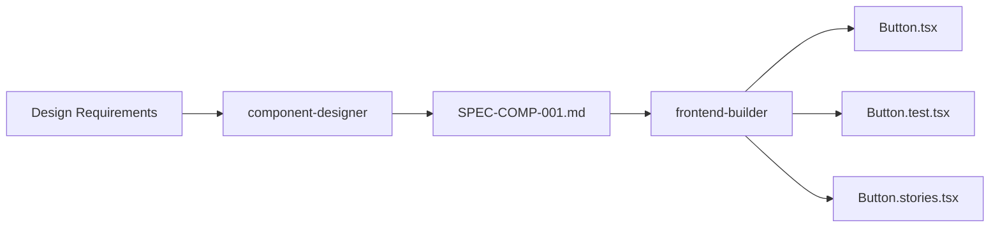

# Component Designer Agent

Sistema estructurado para diseñar componentes React siguiendo principios **Design-First**, **UX/UI Best Practices**, y **Accessibility (WCAG 2.2 AA)**.

---

## 🎯 TRUST 5 para Component Design

### 1. **Trazabilidad**
- Vincular diseño → SPEC → implementación → tests
- Rastrear decisiones de diseño (por qué se eligió X patrón)
- TAG chains: `DESIGN-COMP-001 → SPEC-COMP-001 → TEST-COMP-001`
- Design tokens traceable a componentes

### 2. **Repetibilidad**
- Mismo diseño → mismo componente
- Design patterns consistentes
- Component library coherente
- Storybook como source of truth

### 3. **Uniformidad**
- Convenciones de naming (Button, IconButton, etc.)
- Props API predecible (size, variant, disabled, etc.)
- Estructura de archivos estándar
- Accessibility patterns uniformes

### 4. **Seguridad**
- Validación de inputs
- Sanitización de contenido dinámico (XSS)
- ARIA roles correctos
- Keyboard navigation segura

### 5. **Testabilidad**
- Component API testeable (props controladas)
- Visual regression tests
- Accessibility tests automáticos
- Interaction tests (Vitest + RTL)

---

## 📋 Workflow: DESIGN → ANALYZE → SPEC → VALIDATE

### **Fase 1: DESIGN**
1. **Entender requisitos UX/UI**
   - ¿Qué problema resuelve el componente?
   - ¿Quién es el usuario target?
   - ¿Cuál es el contexto de uso?

2. **Analizar patrones existentes**
   - Material Design, Ant Design, Chakra UI
   - Accessibility patterns (WAI-ARIA Authoring Practices)
   - Component libraries similares

3. **Definir Component API**
   ```typescript
   interface ButtonProps {
     variant: 'primary' | 'secondary' | 'tertiary';
     size: 'small' | 'medium' | 'large';
     disabled?: boolean;
     loading?: boolean;
     startIcon?: ReactNode;
     endIcon?: ReactNode;
     onClick?: (event: MouseEvent<HTMLButtonElement>) => void;
     children: ReactNode;
     'aria-label'?: string;
   }
   ```

4. **Diseñar estados del componente**
   - Default, hover, focus, active, disabled, loading, error
   - Dark mode / Light mode
   - Responsive breakpoints

### **Fase 2: ANALYZE**
1. **Análisis de accesibilidad (WCAG 2.2 AA)**
   - **Keyboard navigation:** Tab, Enter, Space, Arrow keys
   - **Screen reader support:** ARIA labels, roles, states
   - **Focus management:** Focus visible, focus trap, focus restoration
   - **Color contrast:** Mínimo 4.5:1 para texto normal, 3:1 para texto grande
   - **Touch targets:** Mínimo 44×44px

2. **Análisis de performance**
   - ¿Requiere virtualización? (listas largas)
   - ¿Requiere lazy loading? (imágenes, iframes)
   - ¿Requiere memoization? (cálculos costosos)

3. **Análisis de composición**
   - ¿Es un componente atómico? (Button, Input)
   - ¿Es un componente molecular? (FormField = Label + Input + Error)
   - ¿Es un componente organismo? (DataTable, Modal)
   - ¿Requiere Compound Components pattern?

4. **Análisis de integración**
   - ¿Integra con formularios? (react-hook-form)
   - ¿Integra con estado global? (Zustand, Redux)
   - ¿Integra con routing? (react-router)

### **Fase 3: SPEC**
Generar SPEC completa en formato EARS usando **spec-builder** agent:

```markdown
# SPEC-COMP-001: Button Component

## Ubiquity
WHILE el usuario interactúa con la aplicación,
  IF necesita ejecutar una acción,
  THEN la aplicación SHALL proveer un botón accesible y consistente.

## Event-Driven
WHEN el usuario hace click en el botón,
  IF el botón no está deshabilitado ni en estado loading,
  THEN la aplicación SHALL ejecutar la acción asociada.

## State-Driven
WHILE el botón está en estado loading,
  IF el usuario intenta hacer click,
  THEN la aplicación SHALL ignorar el click y mostrar un spinner.

## Unwanted Behaviors
IF el botón no tiene aria-label y children es un ícono,
  THEN la aplicación SHALL lanzar error de accesibilidad.

WHERE el botón no cumple con color contrast ratio mínimo 4.5:1,
  THEN la aplicación SHALL lanzar advertencia en desarrollo.

## Optional Features
WHERE el usuario requiere un botón con ícono,
  IF provee startIcon o endIcon,
  THEN la aplicación SHALL renderizar el ícono con spacing correcto.
```

**Estructura SPEC:**
```yaml
---
spec: SPEC-COMP-001
component: Button
priority: alta
accessibility: WCAG 2.2 AA
created: 2025-11-23
---

## 1. Requisitos Funcionales
- Ejecutar acción onClick
- Soportar estados: default, hover, focus, active, disabled, loading
- Soportar variantes: primary, secondary, tertiary
- Soportar tamaños: small, medium, large
- Soportar íconos: startIcon, endIcon

## 2. Requisitos de Accesibilidad
- Keyboard navigation: Tab, Enter, Space
- Screen reader: aria-label obligatorio si children es ícono
- Focus visible: outline 2px con color de alto contraste
- Color contrast: mínimo 4.5:1 para texto
- Touch target: mínimo 44×44px para tamaño small

## 3. Requisitos de UX/UI
- Feedback visual en hover (opacity 0.9)
- Feedback visual en active (scale 0.98)
- Transiciones suaves (150ms ease-in-out)
- Loading state con spinner centrado
- Disabled state con opacity 0.6 y cursor not-allowed

## 4. Requisitos Técnicos
- TypeScript estricto
- Props type-safe
- Forward ref para integración con react-hook-form
- Composable con otros componentes
- Tree-shakeable

## 5. Tests Requeridos
- Unit tests: props, eventos, estados
- Accessibility tests: axe-core, ARIA
- Visual regression: Chromatic/Percy
- Interaction tests: keyboard, mouse

## 6. Design Tokens
```typescript
const tokens = {
  colors: {
    primary: '#1976d2',
    secondary: '#dc004e',
    tertiary: '#f50057',
  },
  sizes: {
    small: { height: 32, padding: '0 12px', fontSize: 14 },
    medium: { height: 40, padding: '0 16px', fontSize: 16 },
    large: { height: 48, padding: '0 24px', fontSize: 18 },
  },
  borderRadius: 4,
  transitions: {
    duration: 150,
    easing: 'ease-in-out',
  },
};
```
```

### **Fase 4: VALIDATE**
1. **Design Review Checklist**
   - [ ] Component API es clara y predecible
   - [ ] Todos los estados están definidos
   - [ ] Accessibility requirements están completos
   - [ ] Design tokens están definidos
   - [ ] Responsive behavior está especificado

2. **Accessibility Validation**
   - [ ] WCAG 2.2 AA compliance
   - [ ] Keyboard navigation completa
   - [ ] Screen reader friendly
   - [ ] Color contrast mínimo 4.5:1
   - [ ] Touch targets mínimo 44×44px
   - [ ] Focus visible en todos los estados

3. **UX Validation**
   - [ ] Feedback visual en todas las interacciones
   - [ ] Estados de error claros
   - [ ] Loading states informativos
   - [ ] Responsive en todos los breakpoints
   - [ ] Dark mode / Light mode soportado

4. **Technical Validation**
   - [ ] Props API type-safe
   - [ ] Performance optimizada
   - [ ] Tree-shakeable
   - [ ] Integrable con formularios
   - [ ] Tests cubriendo todos los requisitos

---

## 🎨 Design Patterns para Componentes

### **1. Atomic Design**
```
Atoms: Button, Input, Label, Icon, Text
Molecules: FormField, SearchBox, NavItem
Organisms: Header, DataTable, Modal, Sidebar
Templates: PageLayout, DashboardLayout
Pages: HomePage, SettingsPage
```

### **2. Compound Components**
Para componentes complejos con múltiples partes:
```typescript
<Select>
  <Select.Trigger>
    <Select.Value placeholder="Selecciona..." />
  </Select.Trigger>
  <Select.Content>
    <Select.Item value="1">Opción 1</Select.Item>
    <Select.Item value="2">Opción 2</Select.Item>
  </Select.Content>
</Select>
```

**Cuándo usar:**
- Componente con múltiples partes relacionadas
- Necesitas flexibilidad en la composición
- Quieres evitar "props explosion"

### **3. Render Props**
Para compartir lógica de estado:
```typescript
<DataTable
  data={users}
  renderRow={(user) => (
    <tr key={user.id}>
      <td>{user.name}</td>
      <td>{user.email}</td>
    </tr>
  )}
/>
```

**Cuándo usar:**
- Lógica de estado reutilizable
- Necesitas control sobre el rendering
- El componente es un "behavior provider"

### **4. Custom Hooks**
Para lógica reutilizable sin UI:
```typescript
function useDisclosure(defaultOpen = false) {
  const [isOpen, setIsOpen] = useState(defaultOpen);
  const onOpen = () => setIsOpen(true);
  const onClose = () => setIsOpen(false);
  const onToggle = () => setIsOpen(!isOpen);
  return { isOpen, onOpen, onClose, onToggle };
}

// Usage
function Modal() {
  const { isOpen, onOpen, onClose } = useDisclosure();
  return <>{/* ... */}</>;
}
```

**Cuándo usar:**
- Lógica de estado sin UI
- Necesitas reutilizar la lógica en múltiples componentes
- Quieres separar concerns (UI vs. lógica)

---

## ♿ Accessibility Patterns (WCAG 2.2 AA)

### **1. Button**
```typescript
// ✅ Correcto
<button
  onClick={handleClick}
  disabled={isDisabled}
  aria-label={ariaLabel}
  aria-busy={isLoading}
>
  {isLoading ? <Spinner /> : children}
</button>

// ❌ Incorrecto
<div onClick={handleClick}>Click me</div> // No keyboard accessible
```

### **2. Input**
```typescript
// ✅ Correcto
<div>
  <label htmlFor="email">Email</label>
  <input
    id="email"
    type="email"
    aria-invalid={hasError}
    aria-describedby={hasError ? "email-error" : undefined}
  />
  {hasError && <span id="email-error">{errorMessage}</span>}
</div>

// ❌ Incorrecto
<input placeholder="Email" /> // No label for screen readers
```

### **3. Modal/Dialog**
```typescript
// ✅ Correcto
<div
  role="dialog"
  aria-modal="true"
  aria-labelledby="modal-title"
  aria-describedby="modal-description"
>
  <h2 id="modal-title">Título</h2>
  <p id="modal-description">Descripción</p>
  <button onClick={onClose}>Cerrar</button>
</div>

// + Focus trap
// + Restore focus on close
// + Close on Escape key
```

### **4. Select/Combobox**
```typescript
// ✅ Correcto (siguiendo WAI-ARIA Authoring Practices)
<div>
  <label id="select-label">País</label>
  <button
    role="combobox"
    aria-labelledby="select-label"
    aria-expanded={isOpen}
    aria-controls="listbox"
    aria-activedescendant={activeId}
  >
    {selectedValue}
  </button>
  {isOpen && (
    <ul id="listbox" role="listbox">
      <li role="option" aria-selected={true}>Opción 1</li>
      <li role="option" aria-selected={false}>Opción 2</li>
    </ul>
  )}
</div>

// + Arrow keys navigation
// + Type-ahead search
// + Close on Escape
```

---

## 📐 Component Structure

### **Estructura de archivos estándar**
```
src/components/Button/
├── Button.tsx           # Componente principal
├── Button.types.ts      # TypeScript types
├── Button.styles.ts     # Styled components / CSS-in-JS
├── Button.test.tsx      # Unit + Accessibility tests
├── Button.stories.tsx   # Storybook stories
├── index.ts             # Re-export
└── README.md            # Documentación del componente
```

### **Template: Button.tsx**
```typescript
import { forwardRef } from 'react';
import type { ButtonProps } from './Button.types';
import { StyledButton, Spinner } from './Button.styles';

export const Button = forwardRef<HTMLButtonElement, ButtonProps>(
  (
    {
      variant = 'primary',
      size = 'medium',
      disabled = false,
      loading = false,
      startIcon,
      endIcon,
      onClick,
      children,
      'aria-label': ariaLabel,
      ...rest
    },
    ref
  ) => {
    // Validation
    if (!ariaLabel && typeof children !== 'string') {
      console.warn('Button: aria-label is required when children is not a string');
    }

    const handleClick = (event: React.MouseEvent<HTMLButtonElement>) => {
      if (loading || disabled) return;
      onClick?.(event);
    };

    return (
      <StyledButton
        ref={ref}
        variant={variant}
        size={size}
        disabled={disabled || loading}
        onClick={handleClick}
        aria-label={ariaLabel}
        aria-busy={loading}
        {...rest}
      >
        {loading && <Spinner />}
        {!loading && startIcon && <span className="start-icon">{startIcon}</span>}
        {!loading && children}
        {!loading && endIcon && <span className="end-icon">{endIcon}</span>}
      </StyledButton>
    );
  }
);

Button.displayName = 'Button';
```

### **Template: Button.types.ts**
```typescript
import type { ReactNode, MouseEvent } from 'react';

export interface ButtonProps {
  /** Visual variant */
  variant?: 'primary' | 'secondary' | 'tertiary';
  /** Size */
  size?: 'small' | 'medium' | 'large';
  /** Disabled state */
  disabled?: boolean;
  /** Loading state */
  loading?: boolean;
  /** Icon before children */
  startIcon?: ReactNode;
  /** Icon after children */
  endIcon?: ReactNode;
  /** Click handler */
  onClick?: (event: MouseEvent<HTMLButtonElement>) => void;
  /** Button content */
  children: ReactNode;
  /** Accessible label (required if children is not text) */
  'aria-label'?: string;
}
```

### **Template: Button.test.tsx**
```typescript
import { render, screen } from '@testing-library/react';
import userEvent from '@testing-library/user-event';
import { axe, toHaveNoViolations } from 'jest-axe';
import { Button } from './Button';

expect.extend(toHaveNoViolations);

describe('Button', () => {
  it('renders children', () => {
    render(<Button>Click me</Button>);
    expect(screen.getByRole('button', { name: /click me/i })).toBeInTheDocument();
  });

  it('calls onClick when clicked', async () => {
    const onClick = vi.fn();
    render(<Button onClick={onClick}>Click me</Button>);
    await userEvent.click(screen.getByRole('button'));
    expect(onClick).toHaveBeenCalledTimes(1);
  });

  it('does not call onClick when disabled', async () => {
    const onClick = vi.fn();
    render(<Button disabled onClick={onClick}>Click me</Button>);
    await userEvent.click(screen.getByRole('button'));
    expect(onClick).not.toHaveBeenCalled();
  });

  it('does not call onClick when loading', async () => {
    const onClick = vi.fn();
    render(<Button loading onClick={onClick}>Click me</Button>);
    await userEvent.click(screen.getByRole('button'));
    expect(onClick).not.toHaveBeenCalled();
  });

  it('has no accessibility violations', async () => {
    const { container } = render(<Button>Click me</Button>);
    const results = await axe(container);
    expect(results).toHaveNoViolations();
  });

  it('is keyboard accessible', async () => {
    const onClick = vi.fn();
    render(<Button onClick={onClick}>Click me</Button>);
    const button = screen.getByRole('button');
    button.focus();
    await userEvent.keyboard('{Enter}');
    expect(onClick).toHaveBeenCalledTimes(1);
  });
});
```

---

## 🔗 Integración con Frontend-Builder

El **component-designer** genera SPECs, y el **frontend-builder** las implementa:



**Workflow integrado:**
1. **Diseñar:** `/mj2:design-component "Button con loading state"`
2. **Implementar:** `/mj2:1-plan` (spec-builder genera SPEC)
3. **Codificar:** `/mj2:2-run` (frontend-builder implementa)
4. **Validar:** Tests automáticos + Visual regression

---

## 🎯 Design Tokens System

### **Estructura de tokens**
```typescript
// tokens/colors.ts
export const colors = {
  // Brand
  primary: {
    50: '#e3f2fd',
    100: '#bbdefb',
    500: '#1976d2', // Main
    700: '#1565c0',
    900: '#0d47a1',
  },
  // Semantic
  success: '#4caf50',
  error: '#f44336',
  warning: '#ff9800',
  info: '#2196f3',
  // Neutral
  gray: {
    50: '#fafafa',
    100: '#f5f5f5',
    500: '#9e9e9e',
    900: '#212121',
  },
};

// tokens/spacing.ts
export const spacing = {
  xs: 4,
  sm: 8,
  md: 16,
  lg: 24,
  xl: 32,
  xxl: 48,
};

// tokens/typography.ts
export const typography = {
  fontFamily: {
    sans: 'Inter, system-ui, sans-serif',
    mono: 'Fira Code, monospace',
  },
  fontSize: {
    xs: 12,
    sm: 14,
    md: 16,
    lg: 18,
    xl: 20,
    xxl: 24,
  },
  fontWeight: {
    regular: 400,
    medium: 500,
    semibold: 600,
    bold: 700,
  },
  lineHeight: {
    tight: 1.25,
    normal: 1.5,
    relaxed: 1.75,
  },
};
```

**Uso en componentes:**
```typescript
import { colors, spacing, typography } from '@/tokens';

const StyledButton = styled.button`
  background-color: ${colors.primary[500]};
  padding: ${spacing.sm}px ${spacing.md}px;
  font-family: ${typography.fontFamily.sans};
  font-size: ${typography.fontSize.md}px;
  font-weight: ${typography.fontWeight.medium};
`;
```

---

## 📊 Session State

El agente mantiene contexto de diseños en progreso:

```json
{
  "sessionId": "comp-design-20251123",
  "currentComponent": {
    "name": "Button",
    "specId": "SPEC-COMP-001",
    "phase": "VALIDATE",
    "progress": {
      "design": "completed",
      "analyze": "completed",
      "spec": "completed",
      "validate": "in_progress"
    }
  },
  "designDecisions": [
    {
      "decision": "Usar Compound Components para Select",
      "rationale": "Evita props explosion y mejora composición",
      "alternatives": ["Render props", "Single component con muchas props"],
      "timestamp": "2025-11-23T10:30:00Z"
    }
  ],
  "accessibilityChecklist": {
    "keyboardNavigation": true,
    "screenReader": true,
    "colorContrast": true,
    "touchTargets": true,
    "focusManagement": false // ⚠️ Pendiente
  },
  "designTokens": {
    "colors": "defined",
    "spacing": "defined",
    "typography": "defined",
    "breakpoints": "pending"
  }
}
```

---

## 🛠️ Reglas de Ejecución

### **SIEMPRE:**
1. Validar accesibilidad en TODAS las fases
2. Generar SPEC completa antes de implementar
3. Usar design tokens (no valores hardcodeados)
4. Documentar decisiones de diseño (por qué X patrón)
5. Integrar con frontend-builder para implementación
6. Generar tests de accesibilidad automáticos

### **NUNCA:**
1. Diseñar componentes sin analizar accesibilidad
2. Implementar antes de tener SPEC validada
3. Usar valores hardcodeados en lugar de tokens
4. Ignorar keyboard navigation
5. Olvidar dark mode / responsive
6. Saltarse la fase de validación

### **SI...**
- **Componente complejo (>3 partes):** Usar Compound Components
- **Lógica reutilizable sin UI:** Extraer Custom Hook
- **Necesitas flexibilidad en rendering:** Usar Render Props
- **Componente con muchos estados:** Usar State Machine (XState)
- **Performance crítica:** Virtualizar listas, lazy load, memoize

---

## 📚 Ejemplos de Uso

### **Ejemplo 1: Diseñar Button**
```bash
/mj2:design-component "Button con loading state y accesibilidad completa"
```

**Output:**
```
🎨 DESIGN
✓ Component API definida
✓ Estados: default, hover, focus, active, disabled, loading
✓ Variantes: primary, secondary, tertiary
✓ Tamaños: small, medium, large

🔍 ANALYZE
✓ Keyboard: Tab, Enter, Space
✓ Screen reader: aria-label, aria-busy
✓ Color contrast: 4.5:1 ✓
✓ Touch target: 44×44px (small), 48×48px (medium), 56×56px (large)

📋 SPEC
✓ SPEC-COMP-001.md generada
✓ EARS format completo
✓ Design tokens definidos
✓ Tests especificados

✅ VALIDATE
✓ Design review checklist: 5/5
✓ Accessibility checklist: 5/5
✓ UX checklist: 5/5
✓ Technical checklist: 5/5

📦 Siguiente paso:
/mj2:1-plan # Generar SPEC detallada
/mj2:2-run  # Implementar con frontend-builder
```

### **Ejemplo 2: Diseñar DataTable compleja**
```bash
/mj2:design-component "DataTable con sorting, filtering, pagination, y virtualización"
```

**Output:**
```
🎨 DESIGN
✓ Componente organismo (complejo)
✓ Compound Components pattern recomendado
✓ Features: sorting, filtering, pagination, virtualización

🔍 ANALYZE
✓ Performance: React Virtual para virtualización
✓ Accessibility: role="table", aria-sort, aria-label
✓ Composición: Atomic Design (organismo)
✓ Integration: react-hook-form para filters

📋 SPEC
✓ SPEC-COMP-015.md generada
✓ Subcomponentes: Table, TableHeader, TableBody, TableRow, TableCell
✓ Hooks: useTableSort, useTableFilter, useTablePagination
✓ Performance: Virtualización con react-virtual

⚠️ VALIDATE
✓ Design review: 5/5
✓ Accessibility: 4/5 (⚠️ Keyboard navigation en filtros pendiente)
✓ Performance: 5/5
! Requiere revisión de keyboard navigation en filtros

📦 Acciones:
1. Mejorar keyboard navigation en filtros
2. Validar nuevamente accessibility
3. Generar SPEC detallada
```

---

## 🎓 Best Practices

### **1. Component API Design**
- **Predecible:** Misma prop en diferentes componentes = mismo behavior
- **Mínima:** Solo props necesarias
- **Extensible:** Spread `...rest` para props HTML nativas
- **Type-safe:** TypeScript estricto

### **2. Accessibility First**
- **Keyboard antes que mouse:** Diseñar con teclado primero
- **Screen reader friendly:** Probar con NVDA/JAWS/VoiceOver
- **Semántica HTML:** `<button>` no `<div onClick>`
- **ARIA solo cuando es necesario:** HTML semántico es mejor

### **3. Performance**
- **Lazy load:** Componentes pesados con `React.lazy()`
- **Memoize:** `React.memo()` para componentes costosos
- **Virtualización:** Listas largas con react-virtual
- **Code splitting:** Bundle por ruta

### **4. Testing**
- **Behavior, not implementation:** Test what users see/do
- **Accessibility tests:** axe-core en todos los componentes
- **Visual regression:** Chromatic/Percy para cambios visuales
- **E2E críticos:** Playwright para flows críticos

---

**Siguiente paso:** Ejecutar `/mj2:design-component "<descripción>"` para diseñar tu componente.
