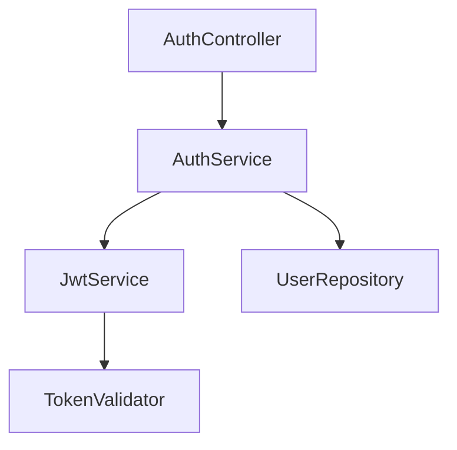

# /mj2:plan-impl - Implementation Planning

Genera plan de implementación ejecutable desde un SPEC usando el **implementation-planner** agent.

## 🎯 Purpose

Transformar SPECs en planes de implementación técnica que desarrolladores puedan ejecutar:
- **Análisis** de SPEC (requirements, constraints, dependencies)
- **Planning** técnico (architecture, stack, patterns)
- **Task breakdown** (tareas granulares 4-8h)
- **Dependency analysis** (external, internal, data, API)
- **Risk assessment** (identification, scoring, mitigation)
- **Complexity estimation** (level, time, team)
- **Architectural design** (diagrams, patterns)

## 📋 Usage

```bash
/mj2:plan-impl <SPEC-ID>                    # Basic plan
/mj2:plan-impl AUTH-001                     # Plan for SPEC-AUTH-001
/mj2:plan-impl AUTH-001 --detail detailed   # Detailed plan
/mj2:plan-impl AUTH-001 --validate          # With validation
/mj2:plan-impl AUTH-001 --format json       # JSON output
```

### Required Arguments

- `<SPEC-ID>` - SPEC identifier (e.g., AUTH-001, TASK-002, PAYMENT-005)

### Optional Flags

- `--detail [basic|medium|detailed]` - Detail level (default: medium)
- `--validate` - Run validation checks before generating plan
- `--format [markdown|json]` - Output format (default: markdown)
- `--help` - Show help

---

## 🔄 Actions

### Action: Generate Implementation Plan

**Command:**
```bash
/mj2:plan-impl <SPEC-ID> [OPTIONS]
```

**What it does:**

1. **Read SPEC:**
   - Locate SPEC document: `docs/specs/SPEC-<DOMAIN>-<NUMBER>/spec.md`
   - Parse requirements (FR-*, NFR-*)
   - Extract constraints and dependencies

2. **Analyze Context:**
   - Scan existing codebase
   - Identify patterns and architecture
   - Find similar implementations

3. **Generate Technical Plan:**
   - Recommend architecture approach
   - Select technology stack
   - Choose design patterns
   - Define API contracts
   - Design database schema

4. **Break Down Tasks:**
   - Create granular tasks (4-8h each)
   - Define acceptance criteria per task
   - Generate dependency graph
   - Identify parallel work opportunities

5. **Assess Risks:**
   - Identify risks (technical, integration, performance, security)
   - Score risks (Probability × Impact)
   - Provide mitigation strategies

6. **Estimate Complexity:**
   - Calculate complexity level
   - Estimate time (optimistic, realistic, pessimistic)
   - Recommend team size and skill level

7. **Design Architecture:**
   - Generate component diagrams (Mermaid)
   - Create sequence diagrams for key flows
   - Recommend class structure

---

## 📊 Detail Levels

### Basic (--detail basic)

**Includes:**
- High-level architecture
- Phase breakdown (no individual tasks)
- Major dependencies
- Top 3 risks
- Overall complexity and time estimate

**Output:**
```markdown
# Plan: SPEC-AUTH-001

## Architecture
[Component diagram]

## Phases
1. Foundation (12h)
2. Auth Logic (16h)
3. Integration (10h)

## Dependencies
- BCrypt.Net (0.1.0)
- System.IdentityModel.Tokens.Jwt (7.0.0)

## Top Risks
1. Security: JWT token validation
2. Performance: Password hashing time
3. Integration: Existing user system

## Estimate
- Complexity: Medium
- Time: 38-45 hours
- Team: 1-2 developers
```

### Medium (--detail medium) - DEFAULT

**Includes:**
- Component diagram
- All phases with task groups
- All dependencies (external + internal)
- All risks with mitigation
- Detailed complexity breakdown
- Quality gates per phase

**Output:**
```markdown
# Plan: SPEC-AUTH-001

## Architecture
[Detailed component diagram]

## Task Breakdown

### Phase 1: Foundation (12h)
1. User Entity (4h)
2. User Repository (4h)
3. Password Service (4h)

### Phase 2: Auth Logic (16h)
4. JWT Service (5h)
5. Auth Service (6h)
6. Login Endpoint (5h)

### Phase 3: Integration (10h)
7. Auth Middleware (4h)
8. Integration Tests (6h)

## Dependency Graph
[Mermaid graph]

## Dependencies

### External
- BCrypt.Net (0.1.0) - Password hashing
- System.IdentityModel.Tokens.Jwt (7.0.0) - JWT tokens

### Internal
- User repository pattern
- Result pattern for error handling

## Risks (5 identified)
[All risks with scoring and mitigation]

## Complexity
- Level: Medium
- Time: 38-45 hours (realistic)
- Team: 1-2 developers
- Skill: Mid-Senior

## Quality Gates
[Checkpoints per phase]
```

### Detailed (--detail detailed)

**Includes everything from Medium, PLUS:**
- Individual task descriptions with acceptance criteria
- Code examples/pseudocode per task
- Test scenarios per task
- Sequence diagrams for complex flows
- Database migration scripts
- API contract examples
- Configuration examples
- Deployment considerations

**Output:**
```markdown
# Plan: SPEC-AUTH-001 (Detailed)

[Everything from Medium, PLUS...]

## Task Details

### Task 1: User Entity (4h)

**Description:**
Create User domain entity with email, password hash, timestamps.

**Acceptance Criteria:**
- [ ] User class with Id, Email, PasswordHash, CreatedAt, UpdatedAt
- [ ] Email validation (regex)
- [ ] Password hash storage (never plain text)
- [ ] Unit tests pass (5 tests)

**Implementation:**
```csharp
public class User
{
  public Guid Id { get; init; }
  public string Email { get; init; }
  private string PasswordHash { get; init; }
  public DateTime CreatedAt { get; init; }
  public DateTime UpdatedAt { get; set; }

  public User(string email, string passwordHash)
  {
    if (!IsValidEmail(email))
      throw new ArgumentException("Invalid email");
    Id = Guid.NewGuid();
    Email = email;
    PasswordHash = passwordHash;
    CreatedAt = DateTime.UtcNow;
    UpdatedAt = DateTime.UtcNow;
  }

  private static bool IsValidEmail(string email)
    => Regex.IsMatch(email, @"^[\w\.-]+@[\w\.-]+\.\w+$");
}
```

**Tests:**
```csharp
[Fact]
public void User_WithValidEmail_PassesValidation()
{
  // Arrange & Act
  var user = new User("test@example.com", "hash");

  // Assert
  Assert.Equal("test@example.com", user.Email);
}

[Fact]
public void User_WithInvalidEmail_ThrowsException()
{
  // Arrange & Act & Assert
  Assert.Throws<ArgumentException>(() =>
    new User("invalid-email", "hash"));
}
```

**Dependencies:**
- None (foundation task)

**Estimated Time:** 4 hours
- Development: 2h
- Testing: 1.5h
- Code review: 0.5h

---

[Repeat for ALL tasks...]

## Sequence Diagrams

### Login Flow
[Detailed sequence diagram]

## Database Schema
```sql
CREATE TABLE users (...);
CREATE INDEX idx_users_email ON users(email);
```

## API Contracts
```csharp
// POST /api/auth/login
public record LoginRequest(string Email, string Password);
public record LoginResponse(string Token, DateTime ExpiresAt);
```

## Configuration
```json
{
  "Jwt": {
    "SecretKey": "[from environment]",
    "Issuer": "myapp",
    "Audience": "myapp-api",
    "ExpirationMinutes": 60
  }
}
```

## Deployment
- Environment variables: JWT_SECRET_KEY
- Database migration required
- Redis cache optional (for token blacklist)
```

---

## 🎨 Examples

### Example 1: Basic Plan

```bash
$ /mj2:plan-impl AUTH-001

✅ Implementation plan generated for SPEC-AUTH-001

📊 Plan Overview:
   - Complexity: Medium
   - Estimated Time: 38-45 hours
   - Team Size: 1-2 developers
   - Tasks: 8 tasks
   - Risks: 5 risks identified

🏗️ Architecture:



📋 Task Breakdown:

### Phase 1: Foundation (12h)
1. User Entity (4h)
2. User Repository (4h)
3. Password Service (4h)

### Phase 2: Auth Logic (16h)
4. JWT Service (5h)
5. Auth Service (6h)
6. Login Endpoint (5h)

### Phase 3: Integration (10h)
7. Auth Middleware (4h)
8. Integration Tests (6h)

⚠️  Risks Identified:

### Risk 1: JWT Token Security
**Score:** 6 (High) - Probability: Medium (2), Impact: High (3)

**Mitigation:**
- Use strong secret key (256+ bits)
- Set reasonable expiration (1-2 hours)
- Implement refresh tokens
- Validate signature on every request

🤖 Mr. mj2 recomienda:
   1. Start with Task 1 (User Entity) - foundation
   2. Use /mj2:2-run for TDD cycle on each task
   3. Test password hashing early (security critical)
   4. Run /mj2:quality-check after each phase
   5. Ver progreso: /mj2:status

💡 Tip: Password hashing es CPU-intensive. Usa bcrypt con work factor 12.
```

### Example 2: Detailed Plan with Validation

```bash
$ /mj2:plan-impl PAYMENT-002 --detail detailed --validate

🔍 Validating SPEC-PAYMENT-002...

✅ SPEC Validation:
   - SPEC file exists: ✓
   - Requirements complete: ✓ (12 FR, 5 NFR)
   - Constraints documented: ✓
   - Dependencies listed: ✓

✅ Implementation plan generated for SPEC-PAYMENT-002

📊 Plan Overview:
   - Complexity: High
   - Estimated Time: 60-75 hours
   - Team Size: 2-3 developers
   - Tasks: 15 tasks
   - Risks: 5 risks identified (3 high, 2 medium)

[... detailed plan follows ...]

### Task 5: Stripe Service (8h)

**Description:**
Implement Stripe integration service with payment intent creation, confirmation, and refund capabilities.

**Acceptance Criteria:**
- [ ] CreatePaymentIntent method implemented
- [ ] ConfirmPayment method implemented
- [ ] RefundPayment method implemented
- [ ] Error handling for all Stripe exceptions
- [ ] Idempotency keys on all requests
- [ ] Unit tests with mocked Stripe client (12 tests)

**Implementation:**
```csharp
public interface IStripeService
{
  Task<Result<PaymentIntent>> CreatePaymentIntentAsync(
    decimal amount,
    string currency,
    string customerId,
    CancellationToken ct);

  Task<Result<PaymentIntent>> ConfirmPaymentAsync(
    string paymentIntentId,
    CancellationToken ct);

  Task<Result<Refund>> RefundPaymentAsync(
    string paymentIntentId,
    decimal? amount,
    CancellationToken ct);
}

public class StripeService : IStripeService
{
  private readonly StripeClient _client;

  public async Task<Result<PaymentIntent>> CreatePaymentIntentAsync(
    decimal amount,
    string currency,
    string customerId,
    CancellationToken ct)
  {
    try
    {
      var options = new PaymentIntentCreateOptions
      {
        Amount = (long)(amount * 100), // Convert to cents
        Currency = currency,
        Customer = customerId,
        PaymentMethodTypes = new List<string> { "card" },
        // IMPORTANT: Idempotency key
        IdempotencyKey = Guid.NewGuid().ToString()
      };

      var paymentIntent = await _client.PaymentIntents.CreateAsync(
        options,
        cancellationToken: ct);

      return Result.Success(paymentIntent);
    }
    catch (StripeException ex)
    {
      return Result.Failure<PaymentIntent>($"Stripe error: {ex.Message}");
    }
  }

  // ... other methods
}
```

**Tests:**
```csharp
[Fact]
public async Task CreatePaymentIntent_ValidInput_ReturnsSuccess()
{
  // Arrange
  var mockClient = new Mock<StripeClient>();
  mockClient
    .Setup(x => x.PaymentIntents.CreateAsync(
      It.IsAny<PaymentIntentCreateOptions>(),
      It.IsAny<RequestOptions>(),
      It.IsAny<CancellationToken>()))
    .ReturnsAsync(new PaymentIntent { Id = "pi_123", Status = "requires_payment_method" });

  var service = new StripeService(mockClient.Object);

  // Act
  var result = await service.CreatePaymentIntentAsync(100m, "usd", "cus_123", CancellationToken.None);

  // Assert
  Assert.True(result.IsSuccess);
  Assert.Equal("pi_123", result.Value.Id);
}

[Fact]
public async Task CreatePaymentIntent_StripeException_ReturnsFailure()
{
  // ... test error handling
}

// ... 10 more tests
```

**Dependencies:**
- Stripe.net (43.0.0)
- Moq (4.20.0) - for testing

**Estimated Time:** 8 hours
- Development: 4h
- Testing: 3h
- Code review: 1h

---

[... 14 more tasks ...]

🤖 Mr. mj2 recomienda:
   1. Review ALL risks before starting (3 high-risk items)
   2. Test Stripe integration in sandbox FIRST
   3. Implement idempotency early (prevents double charging)
   4. Use /mj2:2-run for each task
   5. Security review before webhook deployment
   6. Load test payment flow
   7. Ver progreso: /mj2:status

⚠️  CRITICAL: Este feature maneja dinero. Extra cuidado con:
- Idempotency (no double charging)
- Security (webhook signature validation)
- Error handling (retry logic with exponential backoff)
- Testing (integration tests con Stripe sandbox)

💡 Tip: Stripe Test Mode usa claves diferentes. NUNCA commitees Production keys.
```

### Example 3: JSON Output

```bash
$ /mj2:plan-impl UI-003 --format json

{
  "specId": "UI-003",
  "title": "Data Table Component",
  "complexity": {
    "level": "Medium-High",
    "score": 55,
    "factors": {
      "requirements": 12,
      "dependencies": 8,
      "integrations": 3,
      "risks": 6
    }
  },
  "estimate": {
    "optimistic": 28,
    "realistic": 36,
    "pessimistic": 45,
    "unit": "hours"
  },
  "team": {
    "size": "1-2",
    "skillLevel": "Mid-Senior",
    "roles": ["Frontend Developer"]
  },
  "tasks": [
    {
      "id": 1,
      "title": "DataTable Component",
      "phase": "Foundation",
      "estimate": 4,
      "dependencies": [],
      "acceptanceCriteria": [
        "Props interface defined",
        "Generic typing implemented",
        "Basic rendering works"
      ],
      "tests": [
        "DataTable renders with data",
        "DataTable shows empty state",
        "DataTable handles loading"
      ]
    },
    // ... more tasks
  ],
  "risks": [
    {
      "id": 1,
      "title": "Performance with Large Datasets",
      "category": "Performance",
      "probability": 3,
      "impact": 2,
      "score": 6,
      "level": "High",
      "mitigation": [
        "Virtual scrolling (react-window)",
        "Server-side pagination",
        "Debounced search"
      ]
    }
    // ... more risks
  ],
  "dependencies": {
    "external": [
      { "package": "react-window", "version": "1.8.10", "purpose": "Virtual scrolling" }
    ],
    "internal": [
      { "module": "useTheme hook", "purpose": "Theming" }
    ]
  }
}
```

---

## 🔗 Integration with Workflow

### Before: SPEC Creation

```bash
# 1. Create SPEC
/mj2:1-plan

# 2. Generate implementation plan
/mj2:plan-impl <SPEC-ID>

# 3. Review plan, adjust if needed

# 4. Start implementation
/mj2:2-run
```

### During: Implementation

```bash
# Check plan for current task
/mj2:plan-impl AUTH-001 --detail detailed

# Find specific task
# (search output for "Task 3")

# Implement with TDD
/mj2:2-run

# Validate quality
/mj2:quality-check
```

### After: Review

```bash
# Check completion
/mj2:status

# Update plan if needed
# (if requirements changed)
/mj2:plan-impl AUTH-001 --validate
```

---

## ✅ Best Practices

1. **Always validate first:** Use `--validate` flag to catch issues early
2. **Start with basic:** Review basic plan before requesting detailed
3. **Review risks early:** Don't start implementation without reviewing risks
4. **Use detailed for complex:** Detailed level helps with High complexity SPECs
5. **Update plan as needed:** Plans are living documents, update when requirements change
6. **Share with team:** Review plan with team before starting
7. **Track deviations:** Document when actual implementation differs from plan

---

## 📋 Command Reference

| Flag | Values | Default | Purpose |
|------|--------|---------|---------|
| `--detail` | basic, medium, detailed | medium | Detail level of plan |
| `--validate` | (boolean) | false | Run SPEC validation first |
| `--format` | markdown, json | markdown | Output format |
| `--help` | (boolean) | false | Show help |

---

**Agent:** implementation-planner
**Version:** 1.0.0
**Created:** 2024-11-24
**Tags:** @CODE:IMP-054
