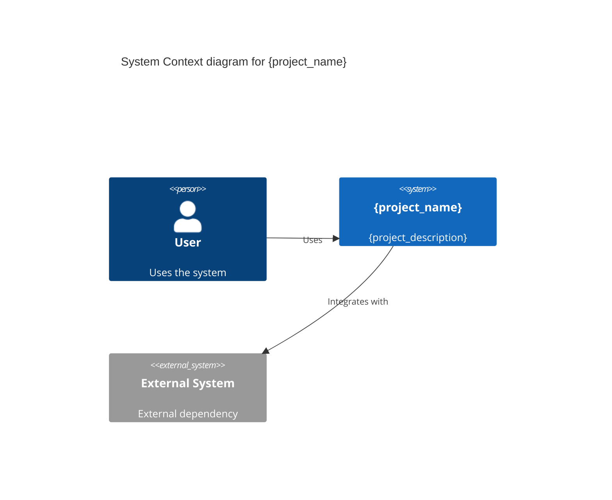

# {project_name}

{project_description}

[](https://github.com/{username}/{repo}/releases)
[](https://github.com/{username}/{repo}/actions)
[](https://codecov.io/gh/{username}/{repo})
[](LICENSE)

---

## Features

- **{feature_1}** - {feature_1_description}
- **{feature_2}** - {feature_2_description}
- **{feature_3}** - {feature_3_description}
- **{feature_4}** - {feature_4_description}

---

## Installation

### Prerequisites

- {prerequisite_1} {version_1}+
- {prerequisite_2} {version_2}+
- {prerequisite_3} {version_3}+

### Steps

```bash
# 1. Clone the repository
git clone https://github.com/{username}/{repo}.git
cd {repo}

# 2. Install dependencies
{install_command}

# 3. Configure environment
cp .env.example .env
# Edit .env with your settings

# 4. Run migrations (if applicable)
{migration_command}

# 5. Start the application
{start_command}
```

---

## Quick Start

### Basic Usage

```{language}
{quick_start_example}
```

### Advanced Example

```{language}
{advanced_example}
```

---

## Documentation

- **[API Documentation](docs/api/README.md)** - REST API reference
- **[Architecture](docs/architecture/README.md)** - System architecture and design
- **[ADRs](docs/adr/README.md)** - Architecture Decision Records
- **[Contributing](CONTRIBUTING.md)** - How to contribute to this project
- **[Changelog](CHANGELOG.md)** - Version history and changes

---

## Configuration

### Environment Variables

| Variable | Description | Default | Required |
|----------|-------------|---------|----------|
| `{var_1}` | {var_1_description} | `{var_1_default}` | Yes |
| `{var_2}` | {var_2_description} | `{var_2_default}` | No |
| `{var_3}` | {var_3_description} | `{var_3_default}` | No |

### Configuration File

```{config_format}
{config_example}
```

---

## Usage

### Command Line

```bash
# {command_1_description}
{command_1}

# {command_2_description}
{command_2}

# {command_3_description}
{command_3}
```

### Programmatic API

```{language}
{programmatic_example}
```

---

## Development

### Setup Development Environment

```bash
# Install development dependencies
{dev_install_command}

# Run tests
{test_command}

# Run linting
{lint_command}

# Build project
{build_command}
```

### Running Tests

```bash
# Unit tests
{unit_test_command}

# Integration tests
{integration_test_command}

# E2E tests
{e2e_test_command}

# Coverage report
{coverage_command}
```

---

## Deployment

### Production Build

```bash
# Build for production
{production_build_command}

# Run production server
{production_run_command}
```

### Docker

```bash
# Build Docker image
docker build -t {image_name}:{version} .

# Run container
docker run -p {port}:{port} {image_name}:{version}
```

### Cloud Deployment

{cloud_deployment_instructions}

---

## API Reference

### Endpoints

| Method | Endpoint | Description | Auth |
|--------|----------|-------------|------|
| GET | `/api/{endpoint_1}` | {endpoint_1_description} | {auth_1} |
| POST | `/api/{endpoint_2}` | {endpoint_2_description} | {auth_2} |
| PUT | `/api/{endpoint_3}` | {endpoint_3_description} | {auth_3} |
| DELETE | `/api/{endpoint_4}` | {endpoint_4_description} | {auth_4} |

See [API Documentation](docs/api/README.md) for detailed endpoint descriptions.

---

## Architecture

### System Overview



See [Architecture Documentation](docs/architecture/README.md) for detailed diagrams.

---

## Contributing

We welcome contributions! Please see [CONTRIBUTING.md](CONTRIBUTING.md) for details on:

- Code of Conduct
- Development process
- Pull request workflow
- Coding standards
- Testing requirements

---

## License

This project is licensed under the {license} License - see the [LICENSE](LICENSE) file for details.

---

## Support

- **Documentation:** [https://{username}.github.io/{repo}](https://{username}.github.io/{repo})
- **Issues:** [GitHub Issues](https://github.com/{username}/{repo}/issues)
- **Discussions:** [GitHub Discussions](https://github.com/{username}/{repo}/discussions)
- **Email:** {support_email}

---

## Acknowledgments

- {acknowledgment_1}
- {acknowledgment_2}
- {acknowledgment_3}

---

**Made with ❤️ by [{author}](https://github.com/{username})**

**Version:** {version} | **Last Updated:** {last_updated}
