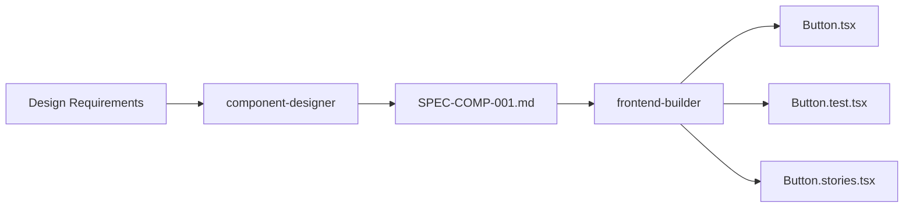

# Issue #49: Component Designer

**Fecha:** 2025-11-23
**Prioridad:** 🟡 Media
**Estado:** ✅ Completado
**Branch:** `feature/issue-49-component-designer`

---

## 📋 Descripción

Agente especializado en diseño sistemático de componentes React con enfoque **Design-First**, **UX/UI Best Practices**, y **Accessibility (WCAG 2.2 AA)**.

---

## 📦 Entregables

### 1. Component Designer Agent (750+ líneas)
- **Workflow:** DESIGN → ANALYZE → SPEC → VALIDATE
- **TRUST 5 Principles** para component design
- **Design Patterns:** Atomic Design, Compound Components, Render Props, Custom Hooks
- **Accessibility:** WCAG 2.2 AA compliance
- **Design Tokens System:** Colors, Spacing, Typography
- **Session State:** Tracking de diseños en progreso

### 2. /mj2:design-component Command (450+ líneas)
- Diseño de componentes con UX/UI analysis
- Validación automática de accesibilidad
- Generación de SPECs en formato EARS
- Design tokens generation
- Integration con frontend-builder (#31)

---

## 🎯 Características Principales

### Design-First Approach
- Analiza requisitos UX/UI antes de implementar
- Define Component API clara y predecible
- Diseña todos los estados (default, hover, focus, active, disabled, loading)
- Selecciona design pattern apropiado (Atomic, Compound, Render Props, Hooks)

### Accessibility Validation (WCAG 2.2 AA)
- **Keyboard navigation:** Tab, Enter, Space, Arrow keys, Escape
- **Screen reader support:** ARIA labels, roles, states
- **Focus management:** Visible focus, focus trap, focus restoration
- **Color contrast:** Mínimo 4.5:1 (texto), 3:1 (UI components)
- **Touch targets:** Mínimo 44×44px

### Design Tokens System
```typescript
const tokens = {
  colors: {
    primary: { 50: '#e3f2fd', 500: '#1976d2', 900: '#0d47a1' },
    success: '#4caf50',
    error: '#f44336',
  },
  spacing: { xs: 4, sm: 8, md: 16, lg: 24, xl: 32 },
  typography: {
    fontFamily: { sans: 'Inter, system-ui, sans-serif' },
    fontSize: { sm: 14, md: 16, lg: 18 },
    fontWeight: { regular: 400, medium: 500, bold: 700 },
  },
};
```

### Component Structure
```
src/components/Button/
├── Button.tsx           # Componente principal
├── Button.types.ts      # TypeScript types
├── Button.styles.ts     # Styled components
├── Button.test.tsx      # Unit + A11y tests
├── Button.stories.tsx   # Storybook stories
└── index.ts             # Re-export
```

---

## 📊 Métricas

- **Archivos:** 3 (1 agent, 1 command, 1 doc)
- **Líneas:** 1,200+
- **Design Patterns:** 4 (Atomic Design, Compound Components, Render Props, Custom Hooks)
- **Accessibility Checks:** 8 (Keyboard, Screen reader, Focus, Contrast, Touch targets, Semantic HTML, Errors, Loading)
- **Workflow Phases:** 4 (DESIGN → ANALYZE → SPEC → VALIDATE)

---

## 🔗 Integración

### Con Frontend-Builder (#31)


**Workflow integrado:**
1. `/mj2:design-component "Button con loading state"`
2. `/mj2:1-plan` (spec-builder genera SPEC)
3. `/mj2:2-run` (frontend-builder implementa)
4. Tests automáticos + Visual regression

### Con Spec-Builder (#24)
- Genera SPECs en formato EARS
- Incluye accessibility requirements
- Define test specifications
- Documenta design decisions

---

## 💡 Ejemplos de Uso

### Ejemplo 1: Button Simple
```bash
/mj2:design-component "Button con loading state"
```

**Output:**
```
🎨 DESIGN
✓ Component API definida
✓ Estados: default, hover, focus, active, disabled, loading
✓ Variantes: primary, secondary, tertiary

🔍 ANALYZE
✓ Keyboard: Tab, Enter, Space ✓
✓ Color contrast: 4.5:1 ✓
✓ Touch target: 44×44px ✓

📋 SPEC
✓ SPEC-COMP-001.md generada

✅ VALIDATE
✓ All checks passed: 5/5
```

### Ejemplo 2: DataTable Compleja
```bash
/mj2:design-component "DataTable con sorting, filtering, pagination y virtualización"
```

**Output:**
```
🎨 DESIGN
✓ Compound Components pattern
✓ Hooks: useTableSort, useTableFilter, useTablePagination

🔍 ANALYZE
✓ Performance: Virtualización con @tanstack/react-virtual
✓ Accessibility: role="table", aria-sort
⚠️ Keyboard navigation requiere testing extensivo

📋 SPEC
✓ SPEC-COMP-015.md generada
✓ Subcomponentes: 6
✓ Hooks: 4

⚠️ VALIDATE
✓ Design review: 5/5
✓ Accessibility: 4/5 (⚠️ Keyboard nav pendiente)
```

---

## ✅ Criterios de Éxito

- [x] Component Designer funcional
- [x] Workflow DESIGN → ANALYZE → SPEC → VALIDATE
- [x] Accessibility validation (WCAG 2.2 AA)
- [x] Design patterns soportados (4)
- [x] Design tokens system
- [x] Integración con frontend-builder
- [x] Comando /mj2:design-component
- [x] Documentación completa con ejemplos

---

## 🎓 Design Patterns Soportados

### 1. Atomic Design
```
Atoms: Button, Input, Label
Molecules: FormField, SearchBox
Organisms: Header, DataTable, Modal
```

### 2. Compound Components
```typescript
<Select>
  <Select.Trigger>
    <Select.Value />
  </Select.Trigger>
  <Select.Content>
    <Select.Item value="1">Opción 1</Select.Item>
  </Select.Content>
</Select>
```

### 3. Render Props
```typescript
<DataTable
  data={users}
  renderRow={(user) => <UserRow user={user} />}
/>
```

### 4. Custom Hooks
```typescript
const { isOpen, onOpen, onClose } = useDisclosure();
```

---

## 🛡️ TRUST 5 Implementation

### Trazabilidad
- TAG chains: DESIGN-COMP-001 → SPEC-COMP-001 → TEST-COMP-001
- Design decisions logged
- Vincular diseño → SPEC → implementación

### Repetibilidad
- Mismo diseño → mismo componente
- Design patterns consistentes
- Component library coherente

### Uniformidad
- Naming conventions estándar
- Props API predecible
- Estructura de archivos estándar

### Seguridad
- Input validation
- XSS sanitization
- ARIA roles correctos
- Keyboard navigation segura

### Testabilidad
- Component API testeable
- Visual regression tests
- Accessibility tests automáticos
- Interaction tests (Vitest + RTL)

---

**Versión:** 1.0.0
**Completado:** 2025-11-23
**Workflow:** DESIGN → ANALYZE → SPEC → VALIDATE
**Integration:** frontend-builder (#31), spec-builder (#24)
