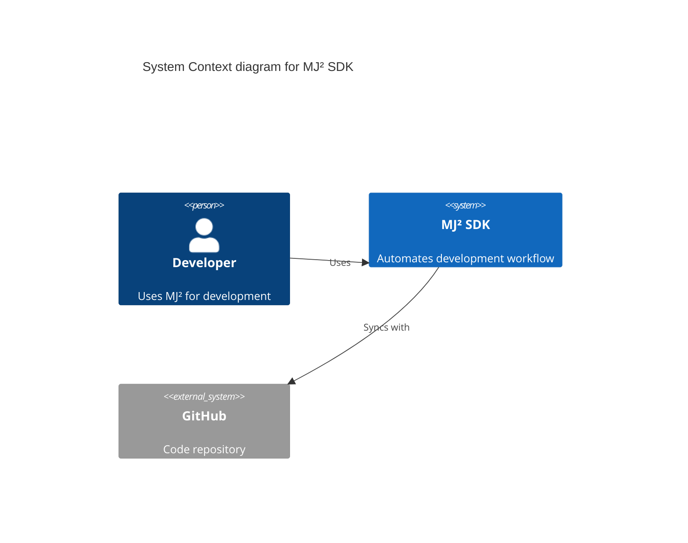

# SPEC-DOC-002: Implementation Plan

**SPEC ID:** SPEC-DOC-002
**Created:** 2024-11-24
**Status:** Draft
**Tags:** @SPEC:DOC-002

---

## 🎯 Implementation Strategy

### Timeline: 5-6 días (40-48 hours)

**Day 1:** SPEC + Agent structure + Audit workflow
**Day 2:** README & CHANGELOG management
**Day 3:** API & Architecture docs
**Day 4:** Templates & Publishing
**Day 5:** Command + Integration
**Day 6:** Testing + Documentation

---

## 📋 Task Breakdown

### Phase 1: SPEC & Planning (4-5 hours) - DAY 1

#### Task 1.1: Create SPEC Documents
**Estimate:** 2-3 hours
**Deliverables:**
- spec.md (requirements in EARS format)
- plan.md (this file)
- acceptance.md (acceptance criteria)

#### Task 1.2: Feature Branch
**Estimate:** 30 min
**Command:**
```bash
git checkout -b feature/SPEC-DOC-002
git add docs/specs/SPEC-DOC-002/
git commit -m "📋 spec(DOC-002): Add SPEC for Docs Manager Agent @SPEC:DOC-002"
```

#### Task 1.3: Agent Structure Design
**Estimate:** 1-2 hours
**Design:**
- Persona: "Documentation Guardian"
- Workflow: AUDIT → UPDATE → GENERATE → PUBLISH
- Responsibilities matrix
- Integration points

---

### Phase 2: Core Agent Implementation (8-10 hours) - DAY 1-2

#### Task 2.1: Create docs-manager.md Agent
**Estimate:** 6-8 hours
**File:** `.claude/agents/mj2/docs-manager.md` (~750 líneas)

**Structure:**
```markdown
---
name: docs-manager
description: Complete documentation management and automation
model: claude-sonnet-4-5-20250929
version: 1.0.0
author: mjcuadrado-net-sdk
tags: [mj2, documentation, automation]
---

# Docs Manager Agent

## 🎭 Agent Persona
Documentation Guardian - Obsesionado con documentación profesional y actualizada

## 📋 Responsibilities
1. Documentation audit
2. README.md management
3. CHANGELOG.md generation
4. API documentation (OpenAPI)
5. Architecture docs (C4, ADRs)
6. Template provision
7. Publishing automation

## 🔄 Workflow

### Phase 1: AUDIT
- Scan project for documentation
- Check README completeness
- Verify CHANGELOG format
- Assess API docs coverage
- Identify missing docs

### Phase 2: UPDATE
- Update README with current metadata
- Add missing sections
- Update badges
- Refresh examples

### Phase 3: GENERATE
- Generate missing docs
- Create ADRs if needed
- Generate API docs from code
- Create architecture diagrams

### Phase 4: PUBLISH
- Prepare for GitHub Pages
- Generate static site
- Update navigation

## 📊 Data Sources
1. README.md - Current content
2. CHANGELOG.md - Release history
3. config.json - Project metadata
4. src/**/*.cs - Code for API docs
5. docs/ - Existing documentation

## 📤 Output Format
[Mr. mj2 recomienda format]
```

**Sections to implement:**
- [ ] Agent metadata (frontmatter)
- [ ] Agent Persona
- [ ] Responsibilities (7 items)
- [ ] Workflow (4 phases: AUDIT → UPDATE → GENERATE → PUBLISH)
- [ ] Data Sources (5 sources)
- [ ] Audit logic (README, CHANGELOG, API, Architecture)
- [ ] Update logic (README sections, badges, metadata)
- [ ] Generation logic (templates, ADRs, diagrams)
- [ ] Publishing logic (GitHub Pages, static sites)
- [ ] Integration with doc-syncer
- [ ] Output format ("Mr. mj2 recomienda")
- [ ] Error handling
- [ ] Examples (3-5 scenarios)
- [ ] Constraints
- [ ] References

#### Task 2.2: Load Foundation Skills
**Estimate:** 1 hour
**Skills to reference:**
- foundation/tags.md
- foundation/specs.md
- foundation/trust.md
- mj2/orchestration-patterns.md

#### Task 2.3: Integration Points
**Estimate:** 1 hour
**Agents to integrate:**
- doc-syncer (delegate TAG sync to it)
- api-designer (get API structure)
- release-manager (CHANGELOG entries)
- quality-gate (documentation coverage)

---

### Phase 3: README Management (6-8 hours) - DAY 2

#### Task 3.1: README Audit Logic
**Estimate:** 2-3 hours
**Checks:**
- [ ] Title present
- [ ] Description present
- [ ] Badges (version, build, coverage)
- [ ] Installation section
- [ ] Usage section
- [ ] Examples section
- [ ] API documentation link
- [ ] Contributing guidelines
- [ ] License

**Implementation:**
```typescript
// Pseudocode
function auditREADME(readme: string): AuditResult {
  return {
    hasTitle: /^# /.test(readme),
    hasBadges: /!\[.*\]\(.*\)/.test(readme),
    hasInstallation: /## Installation/i.test(readme),
    hasUsage: /## Usage/i.test(readme),
    // ... more checks
  }
}
```

#### Task 3.2: README Update Logic
**Estimate:** 2-3 hours
**Updates:**
- [ ] Version badge (from config.json)
- [ ] Build status badge (from CI)
- [ ] Coverage badge (from coverage report)
- [ ] Feature list (from SPEC docs)
- [ ] Installation instructions (from package info)
- [ ] Quick Start (from examples)

#### Task 3.3: README Template
**Estimate:** 1-2 hours
**Template sections:**
```markdown
# {project_name}

{description}

{badges}

## Features
- {feature_1}
- {feature_2}

## Installation
{install_instructions}

## Quick Start
{quick_start_example}

## Documentation
{docs_links}

## Contributing
{contributing_link}

## License
{license}
```

---

### Phase 4: CHANGELOG Management (4-5 hours) - DAY 2

#### Task 4.1: CHANGELOG Audit Logic
**Estimate:** 1-2 hours
**Checks:**
- [ ] Keep a Changelog format
- [ ] Unreleased section present
- [ ] Versions in descending order
- [ ] Each version has date
- [ ] Semantic Versioning followed

#### Task 4.2: CHANGELOG Generation Logic
**Estimate:** 2-3 hours
**Generate from:**
- Git commits (conventional commits)
- SPEC documents (@SPEC, @CODE, @DOC tags)
- GitHub PR/issues
- release-manager data

**Template:**
```markdown
## [X.Y.Z] - YYYY-MM-DD

### Added
- New feature 1
- New feature 2

### Changed
- Change 1

### Deprecated
- Old feature

### Removed
- Removed feature

### Fixed
- Bug fix 1

### Security
- Security improvement
```

#### Task 4.3: Keep a Changelog Compliance
**Estimate:** 1 hour
**Enforce:**
- Standard format
- Link to diffs
- Semantic versioning
- Proper categorization

---

### Phase 5: API & Architecture Docs (6-8 hours) - DAY 3

#### Task 5.1: API Documentation
**Estimate:** 3-4 hours
**Generate:**
- [ ] OpenAPI spec from ASP.NET Core controllers
- [ ] Endpoint documentation
- [ ] Request/response schemas
- [ ] Authentication docs
- [ ] Rate limiting docs

**Tools:**
- Swashbuckle/NSwag for .NET
- Markdown generation from OpenAPI

#### Task 5.2: Architecture Documentation
**Estimate:** 2-3 hours
**Generate:**
- [ ] C4 Context diagram
- [ ] C4 Container diagram
- [ ] C4 Component diagram
- [ ] System overview

**Format:** Mermaid diagrams

**Example:**


#### Task 5.3: ADR Template & Management
**Estimate:** 1 hour
**Template:**
```markdown
# ADR-NNN: {Title}

**Status:** Proposed | Accepted | Deprecated | Superseded

**Date:** YYYY-MM-DD

## Context
{What is the issue we're seeing that is motivating this decision?}

## Decision
{What is the change that we're proposing/have agreed to?}

## Consequences
### Positive
- {Benefit 1}

### Negative
- {Trade-off 1}

### Neutral
- {Impact 1}
```

---

### Phase 6: Templates & Publishing (4-5 hours) - DAY 4

#### Task 6.1: Documentation Templates
**Estimate:** 2-3 hours
**Create:**
- [ ] README.md template
- [ ] CHANGELOG.md template
- [ ] ADR template
- [ ] CONTRIBUTING.md template
- [ ] CODE_OF_CONDUCT.md template

**Location:** `.claude/templates/docs/`

#### Task 6.2: GitHub Pages Support
**Estimate:** 1-2 hours
**Features:**
- Generate `docs/` folder structure
- Create `_config.yml` for Jekyll
- Generate navigation
- Create index.md

#### Task 6.3: Static Site Generation
**Estimate:** 1 hour
**Support for:**
- Jekyll (GitHub Pages default)
- MkDocs
- Docusaurus

---

### Phase 7: Command Implementation (3-4 hours) - DAY 5

#### Task 7.1: Create /mj2:docs Command
**Estimate:** 2-3 hours
**File:** `.claude/commands/mj2-docs.md` (~200 líneas)

**Usage:**
```bash
/mj2:docs audit           # Audit documentation
/mj2:docs update          # Update README & CHANGELOG
/mj2:docs generate        # Generate missing docs
/mj2:docs publish         # Publish to GitHub Pages
/mj2:docs --help          # Help
```

**Actions:**
- `audit` - Run documentation audit, report issues
- `update` - Update README/CHANGELOG with current data
- `generate` - Generate missing docs (ADRs, API docs)
- `publish` - Prepare for publishing

#### Task 7.2: Command Documentation
**Estimate:** 1 hour
**Sections:**
- Usage examples
- Action descriptions
- Output format
- Integration with workflow

---

### Phase 8: Integration & Testing (6-8 hours) - DAY 5-6

#### Task 8.1: Integration with doc-syncer
**Estimate:** 2 hours
**Workflow:**
```
docs-manager (audit/update/generate) → doc-syncer (TAG sync) → Git commit
```

**Delegation:**
- docs-manager handles content generation
- doc-syncer handles TAG chain sync
- No overlap, complementary

#### Task 8.2: Integration with api-designer
**Estimate:** 1 hour
**Flow:**
```
api-designer (API structure) → docs-manager (API docs generation)
```

#### Task 8.3: Integration with release-manager
**Estimate:** 1 hour
**Flow:**
```
release-manager (release) → docs-manager (CHANGELOG entry) → doc-syncer (sync)
```

#### Task 8.4: Integration with quality-gate
**Estimate:** 1 hour
**Add to quality-gate:**
- Documentation coverage check
- README completeness check
- CHANGELOG format check

#### Task 8.5: End-to-End Testing
**Estimate:** 2-3 hours
**Test scenarios:**
1. Fresh project → `/mj2:docs audit` → Report missing docs
2. Existing project → `/mj2:docs update` → README/CHANGELOG updated
3. API changes → `/mj2:docs generate` → API docs generated
4. Release → `/mj2:docs publish` → GitHub Pages ready

---

### Phase 9: Documentation & Examples (4-5 hours) - DAY 6

#### Task 9.1: Update README.md
**Estimate:** 1 hour
**Add:**
- `/mj2:docs` command documentation
- docs-manager agent description

#### Task 9.2: Update ROADMAP.md
**Estimate:** 1 hour
**Mark:**
- Issue #56 as COMPLETED
- v0.6.0 progress updated

#### Task 9.3: Update CHANGELOG.md
**Estimate:** 1 hour
**Entry:**
```markdown
- ✅ **2024-11-24**: Issue #56 - Docs Manager Agent
  - docs-manager.md agent (~750 líneas)
  - /mj2:docs command (~200 líneas)
  - Documentation templates (5)
  - Integration with doc-syncer, api-designer, release-manager
```

#### Task 9.4: Create Examples
**Estimate:** 1-2 hours
**Examples:**
- README template filled
- CHANGELOG with real entries
- ADR example
- API docs sample

---

### Phase 10: Git & Release (2-3 hours) - DAY 6

#### Task 10.1: Git Commits
**Estimate:** 1 hour
**Commits:**
```bash
# SPEC commit (already done)
git commit -m "📋 spec(DOC-002): Add SPEC @SPEC:DOC-002"

# CODE commit
git add .claude/agents/mj2/docs-manager.md
git add .claude/commands/mj2-docs.md
git add .claude/templates/docs/
git commit -m "🟢 feat(DOC-002): Add docs-manager agent & command @CODE:DOC-002"

# DOC commit
git add README.md ROADMAP.md CHANGELOG.md
git commit -m "📚 docs(DOC-002): Update documentation @DOC:DOC-002"
```

#### Task 10.2: Merge & Push
**Estimate:** 30 min
```bash
git checkout main
git merge feature/SPEC-DOC-002
git push origin main
```

#### Task 10.3: Close Issue
**Estimate:** 30 min
```bash
gh issue close 56 -c "✅ Issue #56 completado!"
```

---

## 📊 Progress Tracking

### Checklist

**Phase 1: SPEC & Planning**
- [ ] spec.md created
- [ ] plan.md created
- [ ] acceptance.md created
- [ ] Feature branch created
- [ ] SPEC commit

**Phase 2: Core Agent**
- [ ] docs-manager.md agent (~750 líneas)
- [ ] Load foundation skills
- [ ] Integration points defined

**Phase 3: README Management**
- [ ] README audit logic
- [ ] README update logic
- [ ] README template

**Phase 4: CHANGELOG Management**
- [ ] CHANGELOG audit logic
- [ ] CHANGELOG generation logic
- [ ] Keep a Changelog compliance

**Phase 5: API & Architecture**
- [ ] API documentation generation
- [ ] Architecture documentation (C4)
- [ ] ADR template & management

**Phase 6: Templates & Publishing**
- [ ] Documentation templates (5)
- [ ] GitHub Pages support
- [ ] Static site generation support

**Phase 7: Command**
- [ ] /mj2:docs command (~200 líneas)
- [ ] Command documentation

**Phase 8: Integration & Testing**
- [ ] doc-syncer integration
- [ ] api-designer integration
- [ ] release-manager integration
- [ ] quality-gate integration
- [ ] End-to-end testing

**Phase 9: Documentation**
- [ ] README.md updated
- [ ] ROADMAP.md updated
- [ ] CHANGELOG.md updated
- [ ] Examples created

**Phase 10: Git & Release**
- [ ] CODE commit (@CODE:DOC-002)
- [ ] DOC commit (@DOC:DOC-002)
- [ ] Merge to main
- [ ] Issue #56 closed

---

## 🎯 Success Criteria

### Completion Criteria

- [x] SPEC completa (spec.md, plan.md, acceptance.md)
- [x] docs-manager.md agent (~750 líneas)
- [x] /mj2:docs command (~200 líneas)
- [x] 5 documentation templates
- [x] Integration with 4 agents (doc-syncer, api-designer, release-manager, quality-gate)
- [x] End-to-end testing passed
- [x] TAG chain completa (@SPEC → @CODE → @DOC)
- [x] Documentation updated (README, ROADMAP, CHANGELOG)

### Deliverables

- [x] docs-manager.md agent
- [x] /mj2:docs command
- [x] README template
- [x] CHANGELOG template
- [x] ADR template
- [x] CONTRIBUTING template
- [x] CODE_OF_CONDUCT template
- [x] Documentation updated

---

## 🔗 References

- **SPEC:** `docs/specs/SPEC-DOC-002/spec.md`
- **Issue #56:** `.github/issues/issue-56.md`
- **moai-adk:** docs-manager agent
- **Keep a Changelog:** https://keepachangelog.com/
- **C4 Model:** https://c4model.com/

---

**Created:** 2024-11-24
**Status:** Draft
**Next:** Execute Phase 1 (SPEC & Planning)
