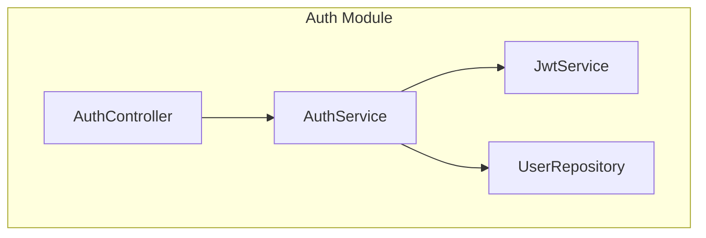

# SPEC-IMP-054: Acceptance Criteria

**SPEC ID:** SPEC-IMP-054
**Created:** 2024-11-24
**Tags:** @SPEC:IMP-054

---

## ✅ Acceptance Criteria

### 1. implementation-planner Agent Created

#### AC-1.1: Agent File Exists
**GIVEN** SPEC-IMP-054 implemented
**WHEN** checking agent directory
**THEN** `.claude/agents/mj2/implementation-planner.md` exists with ~700 lines

**Verification:**
```bash
[ -f ".claude/agents/mj2/implementation-planner.md" ]
wc -l .claude/agents/mj2/implementation-planner.md | grep -E "[67][0-9]{2}|800"
```

#### AC-1.2: Agent Has Required Sections
**GIVEN** implementation-planner.md file
**WHEN** reading content
**THEN** contains all required sections:
- Agent Persona
- Responsibilities (7 items minimum)
- Workflow (ANALYZE → PLAN → BREAK_DOWN → VALIDATE)
- Data Sources
- Output Format ("Mr. mj2 recomienda")
- Examples
- Constraints
- References

**Verification:**
```bash
grep -q "## 🎭 Agent Persona" .claude/agents/mj2/implementation-planner.md
grep -q "## 📋 Responsibilities" .claude/agents/mj2/implementation-planner.md
grep -q "## 🔄 Workflow" .claude/agents/mj2/implementation-planner.md
grep -q "ANALYZE.*PLAN.*BREAK_DOWN.*VALIDATE" .claude/agents/mj2/implementation-planner.md
```

---

### 2. /mj2:plan-impl Command Implemented

#### AC-2.1: Command File Exists
**GIVEN** SPEC-IMP-054 implemented
**WHEN** checking commands directory
**THEN** `.claude/commands/mj2-plan-impl.md` exists with ~200 lines

**Verification:**
```bash
[ -f ".claude/commands/mj2-plan-impl.md" ]
wc -l .claude/commands/mj2-plan-impl.md | grep -E "1[5-9][0-9]|2[0-9]{2}"
```

#### AC-2.2: Command Options Supported
**GIVEN** /mj2:plan-impl command
**WHEN** reviewing command
**THEN** supports options:
- `--detail [basic|medium|detailed]`
- `--validate`
- `--format [markdown|json]`

**Verification:**
```bash
grep -q "\-\-detail" .claude/commands/mj2-plan-impl.md
grep -q "\-\-validate" .claude/commands/mj2-plan-impl.md
grep -q "\-\-format" .claude/commands/mj2-plan-impl.md
```

---

### 3. SPEC Analysis Works

#### AC-3.1: SPEC Parsing
**GIVEN** valid SPEC document
**WHEN** running `/mj2:plan-impl <SPEC-ID>`
**THEN** extracts:
- Functional requirements (FR-*)
- Non-functional requirements (NFR-*)
- Constraints
- Dependencies

**Manual Test:**
```bash
# Create test SPEC
# Run: /mj2:plan-impl TEST-001
# Verify: All requirements extracted
```

#### AC-3.2: Context Analysis
**GIVEN** existing codebase
**WHEN** analyzing SPEC
**THEN** identifies:
- Existing patterns
- Similar implementations
- Integration points
- Technical debt areas

---

### 4. Technical Planning Works

#### AC-4.1: Architectural Approach
**GIVEN** SPEC with medium-high complexity
**WHEN** generating plan
**THEN** recommends:
- Architectural patterns (Repository, Service, etc.)
- Layer structure (Presentation, Application, Domain, Infrastructure)
- Design patterns (Factory, Strategy, etc.)

**Manual Test:**
```bash
# Run: /mj2:plan-impl COMPLEX-SPEC --detail detailed
# Verify: Architectural recommendations present
```

#### AC-4.2: Technology Stack
**GIVEN** SPEC requirements
**WHEN** planning implementation
**THEN** recommends:
- Libraries/frameworks needed
- NuGet packages with versions
- npm packages (if frontend)
- Justification for each choice

---

### 5. Task Breakdown Works

#### AC-5.1: Granular Tasks
**GIVEN** implementation plan generated
**WHEN** reviewing task breakdown
**THEN** each task:
- Has clear description
- Is 4-8 hours max
- Has acceptance criteria
- Is testable

**Verification:**
```
Task format:
### Task N: [Title] (Xh)

**Description:** [Clear what/why/how]

**Acceptance Criteria:**
- [ ] Criterion 1
- [ ] Criterion 2

**Tests:**
- Unit test X
- Integration test Y
```

#### AC-5.2: Dependency Graph
**GIVEN** tasks with dependencies
**WHEN** generating plan
**THEN** includes:
- Mermaid diagram showing dependencies
- Task execution order
- Parallel work opportunities
- Critical path identification

**Manual Test:**
```bash
# Run: /mj2:plan-impl AUTH-001
# Verify: Dependency graph in Mermaid format
```

---

### 6. Dependency Analysis Works

#### AC-6.1: External Dependencies
**GIVEN** SPEC requiring external libraries
**WHEN** analyzing dependencies
**THEN** lists:
- NuGet packages (with versions)
- npm packages (with versions)
- External APIs
- Cloud services

**Example:**
```markdown
## Dependencies

### NuGet Packages
- Microsoft.EntityFrameworkCore (9.0.0) - Database ORM
- Serilog.AspNetCore (8.0.0) - Structured logging

### npm Packages
- react (18.2.0) - UI framework
- @tanstack/react-query (5.0.0) - Data fetching
```

#### AC-6.2: Internal Dependencies
**GIVEN** existing codebase
**WHEN** analyzing dependencies
**THEN** identifies:
- Modules to modify
- Existing services to use
- Database tables to update
- API endpoints to integrate

---

### 7. Risk Assessment Works

#### AC-7.1: Risk Identification
**GIVEN** implementation plan
**WHEN** assessing risks
**THEN** identifies risks in categories:
- Technical (complexity, unknowns)
- Integration (breaking changes)
- Performance (scalability)
- Security (vulnerabilities)

**Example:**
```markdown
## Risks

### Risk 1: N+1 Query Problem
**Category:** Performance
**Probability:** Medium (2)
**Impact:** High (3)
**Score:** 6 (High)

**Mitigation:**
- Use eager loading (.Include())
- Implement projection
- Add monitoring
```

#### AC-7.2: Risk Scoring
**GIVEN** identified risks
**WHEN** scoring risks
**THEN** uses matrix:
- Probability: Low (1), Medium (2), High (3)
- Impact: Low (1), Medium (2), High (3)
- Score = Probability × Impact
- Level: 1-2 Low, 3-4 Medium, 6-9 High

---

### 8. Complexity Estimation Works

#### AC-8.1: Complexity Level
**GIVEN** SPEC analyzed
**WHEN** estimating complexity
**THEN** provides:
- Overall level (Low/Medium/Medium-High/High/Very High)
- Justification for level
- Factors contributing to complexity

**Formula verification:**
```typescript
complexity_score = (
  requirements_count * 0.2 +
  dependencies_count * 0.3 +
  integration_points * 0.2 +
  risk_score * 0.3
)

Levels:
- 0-20: Low
- 21-40: Medium
- 41-60: Medium-High
- 61-80: High
- 81-100: Very High
```

#### AC-8.2: Time Estimation
**GIVEN** task breakdown
**WHEN** estimating time
**THEN** provides:
- Per-task estimates
- Total time (sum + complexity multiplier)
- Range (optimistic, realistic, pessimistic)

---

### 9. Architectural Design Works

#### AC-9.1: Component Diagrams
**GIVEN** medium-high complexity SPEC
**WHEN** generating plan
**THEN** includes:
- Component diagram (Mermaid)
- Class relationships
- Module boundaries

**Example:**


#### AC-9.2: Sequence Diagrams
**GIVEN** complex flow
**WHEN** generating plan
**THEN** includes:
- Sequence diagram for key flows (Mermaid)
- Actor interactions
- System boundaries

---

### 10. Integration Tests

#### AC-10.1: Integration with spec-builder
**GIVEN** SPEC created by spec-builder
**WHEN** running implementation-planner
**THEN** correctly:
- Reads SPEC document
- Extracts requirements
- References SPEC ID
- Maintains TAG chain

**Test:**
```bash
# Run: /mj2:1-plan (creates SPEC)
# Run: /mj2:plan-impl <SPEC-ID>
# Verify: Plan references SPEC correctly
```

#### AC-10.2: Integration with tdd-implementer
**GIVEN** implementation plan generated
**WHEN** reviewing outputs
**THEN** provides:
- Test scenarios for TDD
- Acceptance criteria per task
- Clear RED-GREEN-REFACTOR guidance

**Test:**
```bash
# Run: /mj2:plan-impl AUTH-001
# Verify: Test scenarios provided
# Run: /mj2:2-run (should use plan)
```

#### AC-10.3: Integration with quality-gate
**GIVEN** implementation plan
**WHEN** defining quality checkpoints
**THEN** specifies:
- Validation points per task
- Quality metrics
- Coverage targets
- TRUST 5 compliance checks

---

### 11. Output Format

#### AC-11.1: Mr. mj2 Format
**GIVEN** plan generated
**WHEN** showing output
**THEN** uses "Mr. mj2 recomienda" format:

```
✅ Implementation plan generated for [SPEC-ID]

📊 Plan Overview:
   - Complexity: [Level]
   - Estimated Time: [X hours]
   - Tasks: [N tasks]
   - Risks: [N risks identified]

🏗️ Architecture:
   [Component diagram]

📋 Task Breakdown:
   1. [Task 1] (Xh)
   2. [Task 2] (Xh)
   ...

⚠️  Risks Identified:
   1. [Risk 1] (Score: X)
   2. [Risk 2] (Score: Y)

🤖 Mr. mj2 recomienda:
   1. Start with [Task 1]
   2. Review risks before implementation
   3. Use /mj2:2-run to begin TDD cycle
   4. Ver estado: /mj2:status

💡 Tip: [Helpful tip specific to this plan]
```

---

### 12. Documentation Updated

#### AC-12.1: README Updated
**GIVEN** Issue #54 completed
**WHEN** checking README.md
**THEN** includes:
- /mj2:plan-impl command documentation
- implementation-planner agent in agent list

**Verification:**
```bash
grep -q "/mj2:plan-impl" README.md
grep -q "implementation-planner" README.md
```

#### AC-12.2: ROADMAP Updated
**GIVEN** Issue #54 completed
**WHEN** checking ROADMAP.md
**THEN** Issue #54 marked COMPLETED

**Verification:**
```bash
grep -A 5 "Issue #54" docs/ROADMAP.md | grep -q "✅ COMPLETADO"
```

#### AC-12.3: CHANGELOG Updated
**GIVEN** Issue #54 completed
**WHEN** checking CHANGELOG.md
**THEN** has entry for Issue #54

**Verification:**
```bash
grep -q "Issue #54" CHANGELOG.md
grep -q "@CODE:IMP-054" CHANGELOG.md
grep -q "@DOC:IMP-054" CHANGELOG.md
```

---

### 13. TAG Chain Complete

#### AC-13.1: SPEC Tag Present
**GIVEN** SPEC created
**WHEN** checking git log
**THEN** has commit with @SPEC:IMP-054

**Verification:**
```bash
git log --grep="@SPEC:IMP-054" --oneline | wc -l | grep -E "[1-9]"
```

#### AC-13.2: CODE Tag Present
**GIVEN** agent and command implemented
**WHEN** checking git log
**THEN** has commit(s) with @CODE:IMP-054

**Verification:**
```bash
git log --grep="@CODE:IMP-054" --oneline | wc -l | grep -E "[1-9]"
```

#### AC-13.3: DOC Tag Present
**GIVEN** documentation updated
**WHEN** checking git log
**THEN** has commit with @DOC:IMP-054

**Verification:**
```bash
git log --grep="@DOC:IMP-054" --oneline | wc -l | grep -E "[1-9]"
```

---

## 📋 Manual Testing Checklist

### Pre-Implementation Checklist

- [ ] SPEC-IMP-054 reviewed and approved
- [ ] Dependencies verified (spec-builder, tdd-implementer, quality-gate)
- [ ] Agent structure designed
- [ ] Integration points identified

### Implementation Checklist

- [ ] implementation-planner.md agent created (~700 lines)
- [ ] /mj2:plan-impl command created (~200 lines)
- [ ] SPEC analysis implemented
- [ ] Task breakdown implemented
- [ ] Dependency analysis implemented
- [ ] Risk assessment implemented
- [ ] Complexity estimation implemented
- [ ] Architectural design implemented

### Integration Checklist

- [ ] spec-builder integration tested
- [ ] tdd-implementer integration tested
- [ ] quality-gate integration tested
- [ ] doc-syncer integration tested

### Testing Checklist

- [ ] `/mj2:plan-impl <SPEC-ID>` works
- [ ] `--detail` option works
- [ ] `--validate` option works
- [ ] SPEC parsing works
- [ ] Task breakdown is granular
- [ ] Dependency graph generated
- [ ] Risks identified and scored
- [ ] Complexity estimated correctly
- [ ] Diagrams generated (Mermaid)
- [ ] Output format correct ("Mr. mj2 recomienda")

### Documentation Checklist

- [ ] README.md updated
- [ ] ROADMAP.md updated
- [ ] CHANGELOG.md updated
- [ ] Examples provided

### Git Checklist

- [ ] SPEC commit with @SPEC:IMP-054
- [ ] CODE commit(s) with @CODE:IMP-054
- [ ] DOC commit with @DOC:IMP-054
- [ ] TAG chain complete
- [ ] Merged to main
- [ ] Pushed to GitHub

### Release Checklist

- [ ] Issue #54 closed
- [ ] All acceptance criteria met
- [ ] End-to-end testing passed

---

## 🎯 Definition of Done

**Issue #54 está DONE cuando:**

1. ✅ implementation-planner.md agent creado (~700 líneas)
2. ✅ /mj2:plan-impl command creado (~200 líneas)
3. ✅ SPEC analysis funciona (parsing, context)
4. ✅ Task breakdown funciona (granular, dependencies)
5. ✅ Dependency analysis funciona (external, internal)
6. ✅ Risk assessment funciona (identification, scoring, mitigation)
7. ✅ Complexity estimation funciona (level, time)
8. ✅ Architectural design funciona (diagrams, patterns)
9. ✅ Integration con 4 agentes funciona
10. ✅ Output format "Mr. mj2 recomienda" implementado
11. ✅ TAG chain completa (@SPEC → @CODE → @DOC)
12. ✅ Documentation actualizada (README, ROADMAP, CHANGELOG)
13. ✅ End-to-end testing passed
14. ✅ Issue #54 cerrado en GitHub

---

**Created:** 2024-11-24
**Status:** Draft
**Next:** Begin implementation (Phase 2: Core Agent)
