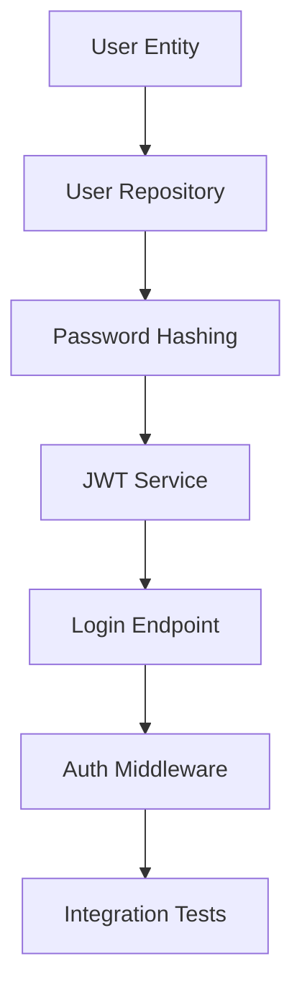
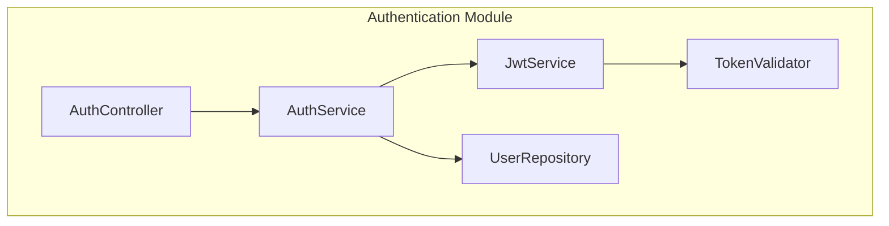

# SPEC-IMP-054: Implementation Plan

**SPEC ID:** SPEC-IMP-054
**Created:** 2024-11-24
**Status:** Draft
**Tags:** @SPEC:IMP-054

---

## 🎯 Implementation Strategy

### Timeline: 5-6 días (32-40 hours)

**Day 1:** SPEC + Agent structure + Analysis workflow
**Day 2:** Task breakdown + Dependency analysis
**Day 3:** Risk assessment + Complexity estimation
**Day 4:** Architectural design + Diagrams
**Day 5:** Command + Integration testing
**Day 6:** Documentation + Final testing

---

## 📋 Task Breakdown

### Phase 1: SPEC & Planning (3-4 hours) - DAY 1

#### Task 1.1: Create SPEC Documents
**Estimate:** 2-3 hours
**Deliverables:**
- spec.md (requirements in EARS format)
- plan.md (this file)
- acceptance.md (acceptance criteria)

#### Task 1.2: Feature Branch
**Estimate:** 30 min
**Command:**
```bash
git checkout -b feature/SPEC-IMP-054
git add docs/specs/SPEC-IMP-054/
git commit -m "📋 spec(IMP-054): Add SPEC for Implementation Planner Agent @SPEC:IMP-054"
```

#### Task 1.3: Agent Structure Design
**Estimate:** 1 hour
**Design:**
- Persona: "Implementation Architect"
- Workflow: ANALYZE → PLAN → BREAK_DOWN → VALIDATE
- Responsibilities matrix
- Integration points

---

### Phase 2: Core Agent Implementation (10-12 hours) - DAY 1-2

#### Task 2.1: Create implementation-planner.md Agent
**Estimate:** 8-10 hours
**File:** `.claude/agents/mj2/implementation-planner.md` (~700 líneas)

**Structure:**
```markdown
---
name: implementation-planner
description: Transform SPECs into executable implementation plans
model: claude-sonnet-4-5-20250929
version: 1.0.0
author: mjcuadrado-net-sdk
tags: [mj2, planning, implementation, architecture]
---

# Implementation Planner Agent

## 🎭 Agent Persona
Implementation Architect - Meticuloso, analítico, estratégico

## 📋 Responsibilities
1. SPEC analysis and extraction
2. Technical planning (architecture, stack, patterns)
3. Task breakdown (granular, actionable)
4. Dependency analysis (libs, modules, data, APIs)
5. Risk assessment (technical, integration, performance)
6. Complexity estimation (level, time, team)
7. Architectural design (diagrams, patterns)

## 🔄 Workflow

### Phase 1: ANALYZE
- Read SPEC document
- Extract functional requirements
- Extract non-functional requirements
- Identify constraints and dependencies
- Analyze existing codebase context

### Phase 2: PLAN
- Design architectural approach
- Select technology stack
- Choose design patterns
- Define API contracts
- Design database schema

### Phase 3: BREAK_DOWN
- Divide into granular tasks (4-8h each)
- Define task dependencies
- Order tasks by priority
- Estimate effort per task
- Identify parallel work opportunities

### Phase 4: VALIDATE
- Check completeness (all requirements covered)
- Validate dependencies (no circular deps)
- Assess risks (mitigation strategies)
- Quality gate checkpoints
- Integration with workflow

## 📊 Data Sources
1. SPEC document (requirements)
2. config.json (project metadata)
3. Existing codebase (architecture, patterns)
4. Git history (team velocity)
5. Skills available (capabilities)

## 📤 Output Format
[Mr. mj2 recomienda format]
```

**Sections to implement:**
- [ ] Agent metadata (frontmatter)
- [ ] Agent Persona
- [ ] Responsibilities (7 items)
- [ ] Workflow (4 phases: ANALYZE → PLAN → BREAK_DOWN → VALIDATE)
- [ ] Data Sources (5 sources)
- [ ] SPEC analysis logic
- [ ] Technical planning logic (architecture, stack, patterns)
- [ ] Task breakdown logic (granular, dependencies)
- [ ] Dependency analysis (external, internal, data, API)
- [ ] Risk assessment logic (identification, mitigation)
- [ ] Complexity estimation (level, time, skills)
- [ ] Architectural design (diagrams, patterns)
- [ ] Integration with other agents
- [ ] Output format ("Mr. mj2 recomienda")
- [ ] Error handling
- [ ] Examples (3-5 scenarios)
- [ ] Constraints
- [ ] References

#### Task 2.2: Load Foundation Skills
**Estimate:** 1 hour
**Skills to reference:**
- foundation/tags.md
- foundation/specs.md
- architecture/* (all patterns)
- mj2/orchestration-patterns.md

#### Task 2.3: Integration Points
**Estimate:** 1 hour
**Agents to integrate:**
- spec-builder (consume SPECs)
- tdd-implementer (provide test scenarios)
- quality-gate (validation checkpoints)
- doc-syncer (documentation needs)

---

### Phase 3: SPEC Analysis Logic (4-5 hours) - DAY 2

#### Task 3.1: SPEC Parser
**Estimate:** 2 hours
**Logic:**
- Parse EARS format requirements
- Extract functional requirements
- Extract non-functional requirements
- Identify constraints
- Map requirements to implementation needs

#### Task 3.2: Context Analysis
**Estimate:** 2-3 hours
**Analysis:**
- Scan existing codebase
- Identify existing patterns
- Find similar implementations
- Analyze dependencies
- Assess technical debt

---

### Phase 4: Task Breakdown Logic (5-6 hours) - DAY 2

#### Task 4.1: Task Granularity
**Estimate:** 2-3 hours
**Breakdown strategy:**
- Each task 4-8 hours max
- Clear acceptance criteria per task
- Testable deliverables
- No ambiguity

**Example:**
```markdown
### Task: Implement User Authentication

**Too broad:**
- Implement authentication ❌

**Good breakdown:**
1. Create User entity and repository (4h)
2. Implement password hashing service (3h)
3. Create JWT token service (4h)
4. Implement login endpoint (5h)
5. Add authentication middleware (3h)
6. Write integration tests (4h)
```

#### Task 4.2: Dependency Graph
**Estimate:** 2-3 hours
**Graph generation:**


#### Task 4.3: Parallel Work Identification
**Estimate:** 1 hour
**Identify:**
- Independent tasks (can run in parallel)
- Blocking dependencies
- Critical path
- Team allocation suggestions

---

### Phase 5: Risk Assessment (3-4 hours) - DAY 3

#### Task 5.1: Risk Identification
**Estimate:** 1-2 hours
**Categories:**
- Technical risks (complexity, unknowns)
- Integration risks (breaking changes)
- Performance risks (scalability)
- Security risks (vulnerabilities)

#### Task 5.2: Risk Scoring
**Estimate:** 1 hour
**Scoring matrix:**
```
Probability × Impact = Risk Score

Probability: Low (1), Medium (2), High (3)
Impact: Low (1), Medium (2), High (3)

Risk Score:
- 1-2: Low risk (green)
- 3-4: Medium risk (yellow)
- 6-9: High risk (red)
```

#### Task 5.3: Mitigation Strategies
**Estimate:** 1-2 hours
**Per risk:**
- Mitigation approach
- Contingency plan
- Monitoring strategy
- Owner assignment

---

### Phase 6: Complexity Estimation (2-3 hours) - DAY 3

#### Task 6.1: Complexity Algorithm
**Estimate:** 1-2 hours
**Factors:**
```typescript
complexity = (
  requirements_count * 0.2 +
  dependencies_count * 0.3 +
  integration_points * 0.2 +
  risk_score * 0.3
) / normalization_factor

Levels:
- 0-20: Low
- 21-40: Medium
- 41-60: Medium-High
- 61-80: High
- 81-100: Very High
```

#### Task 6.2: Time Estimation
**Estimate:** 1 hour
**Formula:**
```
total_time = sum(task_estimates) * complexity_multiplier

complexity_multiplier:
- Low: 1.0x
- Medium: 1.2x
- Medium-High: 1.5x
- High: 2.0x
- Very High: 2.5x
```

---

### Phase 7: Architectural Design (5-6 hours) - DAY 4

#### Task 7.1: Component Diagrams
**Estimate:** 2-3 hours
**Generate:**
- C4 Container diagram (if new system)
- Component diagram (classes, modules)
- Mermaid syntax

**Example:**


#### Task 7.2: Sequence Diagrams
**Estimate:** 2 hours
**Generate for:**
- Key user flows
- Complex interactions
- External integrations

#### Task 7.3: Design Pattern Selection
**Estimate:** 1 hour
**Recommend patterns:**
- Repository pattern (data access)
- Service pattern (business logic)
- Result pattern (error handling)
- Factory pattern (object creation)
- Strategy pattern (algorithms)

---

### Phase 8: Command Implementation (3-4 hours) - DAY 5

#### Task 8.1: Create /mj2:plan-impl Command
**Estimate:** 2-3 hours
**File:** `.claude/commands/mj2-plan-impl.md` (~200 líneas)

**Usage:**
```bash
/mj2:plan-impl <SPEC-ID>           # Basic plan
/mj2:plan-impl AUTH-001 --detail   # Detailed plan
/mj2:plan-impl AUTH-001 --validate # With validation
```

**Options:**
- `--detail [basic|medium|detailed]` - Detail level
- `--validate` - Run validation checks
- `--format [markdown|json]` - Output format

#### Task 8.2: Command Documentation
**Estimate:** 1 hour
**Sections:**
- Usage examples
- Options reference
- Output format
- Integration workflow

---

### Phase 9: Integration & Testing (4-5 hours) - DAY 5

#### Task 9.1: Integration with spec-builder
**Estimate:** 1 hour
**Flow:**
```
spec-builder (create SPEC) → implementation-planner (generate plan) → tdd-implementer (execute)
```

#### Task 9.2: Integration with tdd-implementer
**Estimate:** 1 hour
**Provide:**
- Test scenarios
- Task breakdown
- Acceptance criteria

#### Task 9.3: Integration with quality-gate
**Estimate:** 1 hour
**Define:**
- Validation checkpoints
- Quality metrics
- Coverage targets

#### Task 9.4: End-to-End Testing
**Estimate:** 2 hours
**Test scenarios:**
1. Simple SPEC → Plan (low complexity)
2. Medium SPEC → Plan (with dependencies)
3. Complex SPEC → Plan (high complexity, risks)
4. Invalid SPEC → Error handling

---

### Phase 10: Documentation & Examples (4-5 hours) - DAY 6

#### Task 10.1: Update README.md
**Estimate:** 1 hour
**Add:**
- implementation-planner agent description
- /mj2:plan-impl command documentation

#### Task 10.2: Update ROADMAP.md
**Estimate:** 1 hour
**Mark:**
- Issue #54 as COMPLETED
- v0.6.0 progress updated

#### Task 10.3: Update CHANGELOG.md
**Estimate:** 1 hour
**Entry:**
```markdown
- ✅ **2024-11-24**: Issue #54 - Implementation Planner Agent
  - implementation-planner.md agent (~700 líneas)
  - /mj2:plan-impl command (~200 líneas)
  - SPEC analysis + Task breakdown + Risk assessment
  - Integration with spec-builder, tdd-implementer, quality-gate
```

#### Task 10.4: Create Examples
**Estimate:** 1-2 hours
**Examples:**
- Authentication system plan
- CRUD API plan
- Frontend component plan

---

### Phase 11: Git & Release (2-3 hours) - DAY 6

#### Task 11.1: Git Commits
**Estimate:** 1 hour
**Commits:**
```bash
# SPEC commit (already done)
git commit -m "📋 spec(IMP-054): Add SPEC @SPEC:IMP-054"

# CODE commit
git add .claude/agents/mj2/implementation-planner.md
git add .claude/commands/mj2-plan-impl.md
git commit -m "🟢 feat(IMP-054): Add implementation-planner agent & command @CODE:IMP-054"

# DOC commit
git add README.md ROADMAP.md CHANGELOG.md
git commit -m "📚 docs(IMP-054): Update documentation @DOC:IMP-054"
```

#### Task 11.2: Merge & Push
**Estimate:** 30 min
```bash
git checkout main
git merge feature/SPEC-IMP-054
git push origin main
```

#### Task 11.3: Close Issue
**Estimate:** 30 min
```bash
gh issue close 54 -c "✅ Issue #54 completado!"
```

---

## 📊 Progress Tracking

### Checklist

**Phase 1: SPEC & Planning**
- [ ] spec.md created
- [ ] plan.md created
- [ ] acceptance.md created
- [ ] Feature branch created
- [ ] SPEC commit

**Phase 2: Core Agent**
- [ ] implementation-planner.md agent (~700 líneas)
- [ ] Load foundation skills
- [ ] Integration points defined

**Phase 3: SPEC Analysis**
- [ ] SPEC parser logic
- [ ] Context analysis

**Phase 4: Task Breakdown**
- [ ] Task granularity logic
- [ ] Dependency graph generation
- [ ] Parallel work identification

**Phase 5: Risk Assessment**
- [ ] Risk identification
- [ ] Risk scoring
- [ ] Mitigation strategies

**Phase 6: Complexity Estimation**
- [ ] Complexity algorithm
- [ ] Time estimation

**Phase 7: Architectural Design**
- [ ] Component diagrams (Mermaid)
- [ ] Sequence diagrams (Mermaid)
- [ ] Design pattern selection

**Phase 8: Command**
- [ ] /mj2:plan-impl command (~200 líneas)
- [ ] Command documentation

**Phase 9: Integration & Testing**
- [ ] spec-builder integration
- [ ] tdd-implementer integration
- [ ] quality-gate integration
- [ ] End-to-end testing

**Phase 10: Documentation**
- [ ] README.md updated
- [ ] ROADMAP.md updated
- [ ] CHANGELOG.md updated
- [ ] Examples created

**Phase 11: Git & Release**
- [ ] CODE commit (@CODE:IMP-054)
- [ ] DOC commit (@DOC:IMP-054)
- [ ] Merge to main
- [ ] Issue #54 closed

---

## 🎯 Success Criteria

### Completion Criteria

- [ ] SPEC completa (spec.md, plan.md, acceptance.md)
- [ ] implementation-planner.md agent (~700 líneas)
- [ ] /mj2:plan-impl command (~200 líneas)
- [ ] Integration with 4 agents (spec-builder, tdd-implementer, quality-gate, doc-syncer)
- [ ] End-to-end testing passed
- [ ] TAG chain completa (@SPEC → @CODE → @DOC)
- [ ] Documentation updated (README, ROADMAP, CHANGELOG)

### Deliverables

- [ ] implementation-planner.md agent
- [ ] /mj2:plan-impl command
- [ ] SPEC-IMP-054 documents
- [ ] Documentation updated

---

## 🔗 References

- **SPEC:** `docs/specs/SPEC-IMP-054/spec.md`
- **Issue #54:** `.github/issues/issue-54.md`
- **moai-adk:** implementation-planner agent
- **C4 Model:** https://c4model.com/
- **Mermaid:** https://mermaid.js.org/

---

**Created:** 2024-11-24
**Status:** Draft
**Next:** Execute Phase 1 (SPEC & Planning)
