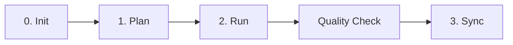

# SPEC-ORCH-064: Acceptance Criteria

**SPEC ID:** SPEC-ORCH-064
**Created:** 2025-11-23
**Status:** In Progress
**Tags:** @SPEC:ORCH-064

---

## ✅ Acceptance Criteria

### AC1: orchestration-patterns.md Skill Created

**GIVEN** un agente necesita entender patrones de orquestación
**WHEN** carga `.claude/skills/mj2/orchestration-patterns.md`
**THEN** el skill debe contener:
- [ ] ~400 líneas de contenido
- [ ] 3 patrones documentados (Sequential, Quality Gate, Parallel)
- [ ] Diagrama mermaid por cada patrón
- [ ] Agent responsibilities matrix (26 agentes)
- [ ] Skills loading strategy
- [ ] User intervention points (5 documentados)
- [ ] Workflow state tracking con TAG chain
- [ ] Ejemplos ejecutables

**Success Metric:** Skill útil para agentes y desarrolladores

---

### AC2: workflow-status Agent Functional

**GIVEN** el usuario ejecuta `/mj2:status`
**WHEN** el agente workflow-status procesa la solicitud
**THEN** debe:
- [ ] Mostrar metadata del proyecto (nombre, versión, branch actual)
- [ ] Mostrar progreso por fases:
  - ✅ Phase completada
  - 🟡 Phase in progress
  - ⏳ Phase pending
- [ ] Detectar fase actual correctamente
- [ ] Recomendar próximo paso
- [ ] Incluir tips útiles
- [ ] Responder en español (default)

**Success Metric:** Output claro y accionable

#### AC2.1: Status en Proyecto No Inicializado

**GIVEN** un directorio sin `.mjcuadrado-net-sdk/`
**WHEN** se ejecuta `/mj2:status`
**THEN** debe:
- [ ] Indicar que proyecto no está inicializado
- [ ] Recomendar `/mj2:0-project`
- [ ] No mostrar error

**Expected Output:**
```
⚠️ Proyecto no inicializado

🤖 Mr. mj2 recomienda:
   1. Inicializar proyecto: /mj2:0-project <nombre>
   2. Ver ayuda: /mj2:help workflow

💡 Tip: El workflow SPEC-First comienza con /mj2:0-project
```

#### AC2.2: Status con SPEC Específica

**GIVEN** un proyecto con SPEC-AUTH-001 en progreso
**WHEN** se ejecuta `/mj2:status AUTH-001`
**THEN** debe:
- [ ] Mostrar estado específico de SPEC-AUTH-001
- [ ] Detectar qué fase está en progreso
- [ ] Verificar TAG chain
- [ ] Recomendar próximo paso específico

**Expected Output:**
```
🤖 Mr. mj2 - Workflow Status: SPEC-AUTH-001

📊 Proyecto: my-api (v0.1.0)
🌿 Branch: feature/SPEC-AUTH-001

Workflow Progress:
✅ Phase 1: SPEC-AUTH-001 creada (2025-11-23)
🟡 Phase 2: Implementación en progreso
   Tests: 4/4 passing ✅
   Coverage: 87% ✅
   TRUST 5: Pendiente
⏳ Phase 3: Quality check pendiente
⏳ Phase 4: Documentación pendiente

🎯 Próximo paso:
   Ejecutar quality check: /mj2:quality-check AUTH-001

💡 Tip: Usa /mj2:help para ver todos los comandos
```

---

### AC3: /mj2:help Command Works

**GIVEN** el usuario ejecuta `/mj2:help`
**WHEN** el comando se procesa
**THEN** debe:
- [ ] Mostrar lista de comandos principales (workflow)
- [ ] Mostrar lista de comandos adicionales
- [ ] Incluir 20+ comandos
- [ ] Output en español
- [ ] Incluir tips útiles

**Success Metric:** Usuario encuentra el comando que necesita

#### AC3.1: Help Sin Argumentos

**GIVEN** usuario ejecuta `/mj2:help`
**WHEN** no proporciona argumentos
**THEN** debe:
- [ ] Listar workflow commands (0-project, 1-plan, 2-run, quality-check, 3-sync)
- [ ] Listar additional commands (15+ comandos)
- [ ] Incluir tip sobre `/mj2:status`

**Expected Output:**
```
🤖 Mr. mj2 - Ayuda

📚 Workflow SPEC-First:

0️⃣ /mj2:0-project           Inicializar proyecto
1️⃣ /mj2:1-plan              Crear SPEC (Plan)
2️⃣ /mj2:2-run               Implementar con TDD (Run)
3️⃣ /mj2:quality-check       Validar calidad
4️⃣ /mj2:3-sync              Sincronizar docs (Sync)

🔧 Comandos adicionales:

/mj2:status                  Ver estado del workflow
/mj2:git-merge              Merge feature branch
/mj2:2f-build               Build frontend (React)
/mj2:4-e2e                  E2E tests (Playwright)
/mj2:5-deploy               Deploy to environment
/mj2:9-feedback             Manage feedback
/mj2:create-agent           Create custom agent
/mj2:create-skill           Create custom skill
/mj2:99-release             Create release
...

💡 Tip: Usa /mj2:status para ver tu posición en el workflow
💡 Usa /mj2:help COMMAND para ayuda específica
```

#### AC3.2: Help con Argumento "workflow"

**GIVEN** usuario ejecuta `/mj2:help workflow`
**WHEN** el comando procesa el argumento
**THEN** debe:
- [ ] Explicar workflow SPEC-First detalladamente
- [ ] Mostrar diagrama o pasos
- [ ] Explicar cada fase

#### AC3.3: Help con Comando Específico

**GIVEN** usuario ejecuta `/mj2:help 1-plan`
**WHEN** el comando procesa el argumento
**THEN** debe:
- [ ] Mostrar ayuda específica de `/mj2:1-plan`
- [ ] Usage examples
- [ ] Output esperado

---

### AC4: README.md Updated with "Mr. mj2"

**GIVEN** un usuario nuevo lee README.md
**WHEN** busca información sobre cómo funciona mj2
**THEN** debe:
- [ ] Encontrar sección "🤖 Mr. mj2 - Tu Asistente de Desarrollo"
- [ ] Entender que Mr. mj2 es el orquestador conceptual
- [ ] Ver lista de agentes especializados que coordina
- [ ] Ver diagrama del workflow
- [ ] Saber que puede usar `/mj2:status` y `/mj2:help`

**Success Metric:** Concepto de orquestación claro para nuevos usuarios

**Expected Content:**
```markdown
## 🤖 Mr. mj2 - Tu Asistente de Desarrollo

Mr. mj2 es el orquestador conceptual que coordina todos los agentes especializados.
Cuando usas mj2, Mr. mj2 entiende tu intención y delega el trabajo a los expertos:

- **Project Manager:** Inicializa proyectos con estructura óptima
- **SPEC Builder:** Convierte ideas en especificaciones EARS
- **TDD Implementer:** Ejecuta el ciclo RED-GREEN-REFACTOR
- **Quality Gate:** Valida que el código cumple TRUST 5
- **Doc Syncer:** Mantiene documentación sincronizada

Mr. mj2 nunca trabaja solo - orquesta expertos para cada tarea.

### 🔄 Workflow SPEC-First



0️⃣ `/mj2:0-project` → Inicializar proyecto
1️⃣ `/mj2:1-plan` → Crear SPEC
2️⃣ `/mj2:2-run` → Implementar con TDD
3️⃣ `/mj2:quality-check` → Validar
4️⃣ `/mj2:3-sync` → Sincronizar docs

💡 Usa `/mj2:status` para ver tu posición en el workflow
💡 Usa `/mj2:help` para guía de comandos
```

---

### AC5: Agent Outputs Updated

**GIVEN** un agente completa su trabajo
**WHEN** genera el output
**THEN** debe seguir el formato "Mr. mj2 recomienda"

**Template:**
```
✅ [Acción] completada: [ID]

🤖 Mr. mj2 recomienda:
   1. [Próximo paso principal]
   2. [Paso alternativo]
   3. Ver estado: /mj2:status [ID]

📊 Estado actual:
   [Métricas relevantes]

💡 Tip: [Consejo útil]
```

#### AC5.1: project-manager Output

**GIVEN** `/mj2:0-project my-api` completa
**WHEN** project-manager genera output
**THEN** debe:
- [ ] Mostrar "✅ Proyecto inicializado: my-api"
- [ ] Incluir "🤖 Mr. mj2 recomienda:"
  - Crear primera SPEC
  - Ver estado
  - Ver ayuda
- [ ] Mostrar estado: Proyecto, Framework, Database, Git
- [ ] Incluir tip sobre workflow

#### AC5.2: spec-builder Output

**GIVEN** `/mj2:1-plan "user auth"` completa
**WHEN** spec-builder genera output
**THEN** debe:
- [ ] Mostrar "✅ SPEC creada: SPEC-AUTH-001"
- [ ] Incluir "🤖 Mr. mj2 recomienda:"
  - Review SPEC
  - Implementar con /mj2:2-run
  - Ver estado
- [ ] Mostrar estado: Archivos creados, Branch creada
- [ ] Incluir tip sobre review

#### AC5.3: tdd-implementer Output

**GIVEN** `/mj2:2-run AUTH-001` completa
**WHEN** tdd-implementer genera output
**THEN** debe:
- [ ] Mostrar "✅ TDD completado: SPEC-AUTH-001"
- [ ] Incluir "🤖 Mr. mj2 recomienda:"
  - Ejecutar quality check
  - Ver coverage
  - Ver estado
- [ ] Mostrar estado: Tests, Coverage, TRUST 5
- [ ] Incluir tip sobre coverage ≥85%

#### AC5.4: quality-gate Output (PASS)

**GIVEN** `/mj2:quality-check AUTH-001` PASS
**WHEN** quality-gate genera output
**THEN** debe:
- [ ] Mostrar "✅ Quality Check PASSED: SPEC-AUTH-001"
- [ ] Incluir "🤖 Mr. mj2 recomienda:"
  - Sincronizar docs
  - Ver estado
  - Crear PR
- [ ] Mostrar estado: Validation results
- [ ] Incluir tip sobre sync

#### AC5.5: doc-syncer Output

**GIVEN** `/mj2:3-sync AUTH-001` completa
**WHEN** doc-syncer genera output
**THEN** debe:
- [ ] Mostrar "✅ Docs sincronizados: SPEC-AUTH-001"
- [ ] Incluir "🤖 Mr. mj2 recomienda:"
  - Review docs
  - Crear PR
  - Celebrate! 🎉
- [ ] Mostrar estado: Docs actualizados, TAG chain completa
- [ ] Incluir tip sobre workflow completo

---

### AC6: TAG Chain Complete

**GIVEN** la implementación de SPEC-ORCH-064 completa
**WHEN** se verifica TAG chain
**THEN** debe existir:
- [ ] @SPEC:ORCH-064 en:
  - spec.md
  - plan.md
  - acceptance.md
  - orchestration-patterns.md
  - README.md (commit message)
- [ ] @CODE:ORCH-064 en:
  - workflow-status.md
  - mj2-status.md
  - mj2-help.md
  - project-manager.md (commit message)
  - spec-builder.md (commit message)
  - tdd-implementer.md (commit message)
  - quality-gate.md (commit message)
  - doc-syncer.md (commit message)
- [ ] @DOC:ORCH-064 en:
  - CHANGELOG.md (commit message)

**Verification Command:**
```bash
# Verificar TAG chain completa
git log --all --oneline --grep="ORCH-064"

# Expected: commits con @SPEC, @CODE, @DOC tags
```

---

### AC7: CHANGELOG.md Updated

**GIVEN** la implementación completa
**WHEN** se lee CHANGELOG.md
**THEN** debe:
- [ ] Incluir entrada en [Unreleased]
- [ ] Sección "Added" con nuevos features
- [ ] Sección "Changed" con agentes actualizados
- [ ] Sección "Improved" con mejoras de UX
- [ ] Referencias a @SPEC:ORCH-064, @CODE:ORCH-064, @DOC:ORCH-064

---

### AC8: End-to-End Workflow Test

**GIVEN** un proyecto nuevo
**WHEN** se ejecuta workflow completo
**THEN** debe:
- [ ] `/mj2:help` → Muestra comandos correctamente
- [ ] `/mj2:status` → Indica proyecto no inicializado
- [ ] `/mj2:0-project test` → Output con formato Mr. mj2
- [ ] `/mj2:status` → Muestra Phase 0 ✅
- [ ] `/mj2:1-plan "test"` → Output con formato Mr. mj2
- [ ] `/mj2:status TEST-001` → Muestra Phase 1 ✅, Phase 2 ⏳
- [ ] `/mj2:help workflow` → Explica workflow completo
- [ ] Sin errores en ningún paso
- [ ] Outputs consistentes en español

---

## 📊 Quantitative Metrics

### Lines of Code

- [ ] orchestration-patterns.md: ~400 líneas
- [ ] workflow-status.md: ~300 líneas
- [ ] mj2-status.md: ~150 líneas
- [ ] mj2-help.md: ~200 líneas
- [ ] README.md: +50-80 líneas
- [ ] 5 agentes: ~50-100 líneas cambios c/u
- [ ] **Total:** ~1,200-1,500 líneas

### Files Changed

- [ ] 1 skill creado
- [ ] 1 agent creado
- [ ] 2 commands creados
- [ ] 1 README updated
- [ ] 5 agentes updated
- [ ] 1 CHANGELOG updated
- [ ] 3 SPEC files (spec, plan, acceptance)
- [ ] **Total:** ~14 archivos

### Commits

- [ ] Commit 1: @SPEC:ORCH-064 (spec + orchestration-patterns + README)
- [ ] Commit 2: @CODE:ORCH-064 part 1 (workflow-status + mj2-status)
- [ ] Commit 3: @CODE:ORCH-064 part 2 (mj2-help)
- [ ] Commit 4: @CODE:ORCH-064 part 3 (5 agentes updated)
- [ ] Commit 5: @DOC:ORCH-064 (CHANGELOG)
- [ ] **Total:** 5 commits

---

## ✅ Definition of Done

### Must Have (Critical)

- [x] orchestration-patterns.md skill creado y válido
- [x] workflow-status.md agent creado y funcional
- [x] mj2-status.md command funciona correctamente
- [x] mj2-help.md command funciona correctamente
- [x] README.md actualizado con sección "Mr. mj2"
- [x] 5 agentes core actualizados con nuevo formato
- [x] TAG chain completa (@SPEC → @CODE → @DOC)
- [x] CHANGELOG.md actualizado
- [x] Sin errores en comandos
- [x] End-to-end test passing

### Nice to Have (Optional)

- [ ] Actualizar más de 5 agentes (idealmente todos los 26)
- [ ] Diagrams mermaid en orchestration-patterns.md
- [ ] Más ejemplos en skill
- [ ] Auto-detect idioma en outputs (ahora es español by default)

---

## 🔍 Review Checklist

### Code Quality

- [ ] Todos los archivos tienen frontmatter correcto
- [ ] Markdown syntax válido
- [ ] No hay typos
- [ ] Formato consistente
- [ ] Código de ejemplo ejecutable

### Documentation

- [ ] SPEC completa (spec, plan, acceptance)
- [ ] README actualizado
- [ ] CHANGELOG actualizado
- [ ] orchestration-patterns.md documentado
- [ ] Comments en archivos donde necesario

### Testing

- [ ] `/mj2:status` probado (3 casos)
- [ ] `/mj2:help` probado (3 casos)
- [ ] Agent outputs probados (5 casos)
- [ ] End-to-end workflow probado
- [ ] TAG chain verificada

### Git

- [ ] 5 commits con mensajes descriptivos
- [ ] TAG chain en commit messages
- [ ] Branch feature/SPEC-ORCH-064 (si se usa)
- [ ] No conflicts
- [ ] Ready para merge

---

**Created:** 2025-11-23
**Status:** In Progress
**Next:** Begin Implementation Phase 1
